# Proof of Learning (PoL) Whitepaper

**Version**: 1.0  
**Core Concept**: **Governance flows with growth: your current learning and contributions determine your present influence.**

---

### **Preface: Why This Whitepaper Is Relevant to You**

In both real-world and digital organizations—whether communities, companies, or network collaboration systems—a common structural dilemma exists:
When critical decisions are needed, decision-making power often remains concentrated with entities possessing **higher historical status or greater capital investment**, rather than those **who have the latest understanding of current issues or are continuously creating cognitive and practical value in reality**.

PoL asks: **In a rapidly changing world, to whom should governance authority—the power to set rules and direction—be entrusted?**

### **PoL vs. PoW/PoS: The Evolution of Consensus Mechanisms**

Before detailing the PoL mechanism, it should be placed within the spectrum of consensus mechanisms for comparative analysis to clarify its core innovation. PoW (Proof of Work), PoS (Proof of Stake), and PoL (Proof of Learning) all attempt to answer the same fundamental question: **In a decentralized system, what mechanism should determine the distribution of power and rewards?**

| Mechanism | Core Answer | Relies on "Non-Forgery Cost" | Common Criticisms |
| :--- | :--- | :--- | :--- |
| **PoW (Proof of Work)** | Quantification based on physical energy expenditure | **External Physical Cost** (computational resource consumption) | Energy inefficiency, potential centralization of computational power |
| **PoS (Proof of Stake)** | Quantification based on economic asset staking | **Internal Economic Cost** (capital lock-up) | Wealth concentration effect, strong correlation between power and capital |
| **PoL (Proof of Learning)** | Quantification based on verifiable learning and contribution | **Internal Cognitive Cost** (time and cognitive investment) | Potential for low-value repetitive behaviors, requires design of effective verification and incentive mechanisms |

#### **Fundamental Differences: Nature of Cost and Direction of Incentives**

Analyzing from the perspective of institutional design, the core differences lie in two dimensions: **the nature of the cost** and **the direction of the incentives**:

1.  **Difference in Cost Nature**
    *   **PoW's cost is external**: Computational resource consumption relates to system security but lacks direct connection to external social value creation.
    *   **PoS's cost is internal and economic**: Capital lock-up relates to system security but does not directly produce knowledge increments or capability improvement.
    *   **PoL's cost is internal and cognitive**: The investment of time and cognition **directly translates into incremental capabilities for individuals and organizations**. In this mechanism, **cost and benefit are unified**—the knowledge assets formed through cognitive investment hold continuous value, rather than being consumptive costs.

2.  **Differences in Incentive Direction**
    *   **PoW incentivizes the maintenance of physical network infrastructure.**
    *   **PoS incentivizes the maintenance of economic asset value.**
    *   **PoL incentivizes the improvement of human capabilities and the solving of real-world problems.**

3.  **Difference in Social Value Output**
    *   PoW/PoS primarily contributes to **internal system security and stability**.
    *   PoL, while also ensuring secure system operation, **directly links incentive mechanisms to real-world capability development and value creation**.

**Core Viewpoint**: Mechanism design itself is neutral; the key lies in the institutional arrangement. Imperfect design can lead to energy centralization in PoW, wealth consolidation in PoS, and similarly can cause low-value repetitive behavior in PoL. The challenge and value of the PoL protocol lie in using systematic mathematical design (such as the triple verification mechanism, time decay mechanism, and health adjustment mechanism detailed later) to guide incentives toward **genuine capability growth** rather than **superficial quantitative metrics**.

Thus, PoL's answer is:
**Governance power should be dynamically granted to individuals and organizations who continuously learn, continuously evolve, and can effectively translate their cognitive outcomes into the ability to solve real-world problems.**

This mechanism concerns not only technical implementation but also the institutional design of power distribution, value recognition, and the exercise of rights in digital systems. To ensure fairness and transparency in rule execution, the protocol adopts mathematically formalized models for automated assessment and allocation. This document presents these mechanisms in a systematic manner.

---
### **The Practical Foundation of PoL**

The core modules and incentive logic of the PoL protocol are embedded within an existing ecosystem: **Skillshop × LearningNav**.

- **Skillshop** serves as the task and value exchange platform, providing practical scenarios and mechanisms for economic value circulation.
- **LearningNav** serves as the dynamic learning path system, providing learning content guidance and a knowledge input source.

The PoL protocol will undergo empirical verification and parameter calibration within the closed loop of **"Learning → Practice → Governance"**. The formulas, verification mechanisms, and governance processes described herein will be tested against real user behavior and market feedback. Effective governance protocol design requires iterative optimization based on real needs and practical feedback.

## **Chapter 1: Core Philosophy and Problem Definition**

### **1.1 Structural Problems in Traditional Governance**

Structural problems exist in traditional governance mechanisms: decision-making power is long-term concentrated with specific entities, making it difficult for new participants to gain a voice, systems lack dynamic adjustment capabilities, and power and responsibility become separated.

### **1.2 The Core Mechanism of PoL: Time Decay and Dynamic Renewal**

The core of the PoL mechanism is that governance power has a time decay characteristic and must be dynamically renewed through continuous cognitive contribution. Its core kinetic equation is as follows:

```
Core Axiom: dP/dt = -λP + β · (dC/dt)
```

**Formula Analysis**:
- **`dP/dt`**: Represents the instantaneous rate of change of power over time. `dP/dt > 0` indicates power growth, `dP/dt < 0` indicates power decay.
- **`-λP`**: **Natural Decay Term**. `λ` (lambda) is the decay constant, which can be understood as the half-life parameter for power. `P` is the current power level. This term ensures that even without new contributions, power naturally decays over time at a fixed rate `λ`. This is the core mechanism to prevent power consolidation.
- **`β · (dC/dt)`**: **Dynamic Renewal Term**. `dC/dt` represents the instantaneous rate of cognitive contribution (the rate of learning and value creation), and `β` (beta) is the conversion efficiency coefficient. The greater the cognitive contribution rate, the larger the value of this term, and the faster the rate of power renewal.

**Mechanism Implication**: This formula ensures the continuity and dynamism of power. Only through continuous cognitive contribution (`dC/dt > 0`) to offset the natural decay (`-λP`) can power levels be maintained or increased. The distribution and maintenance of power are always tied to current performance levels.

---

## **PoL System Architecture Overview**

The following system architecture diagram illustrates the complete operational logic of the PoL mechanism:

```mermaid
graph TD
    A[🌱 Individual Learning & Contribution] --> B{🔬 Triple Verification};
    
    B --> C[💰 Receive Labor Compensation];
    B --> D[📊 Calculate PoL Score];
    
    C --> E[💎 Earn $SKILL Tokens];
    D --> F[⏳ Decay Over Time];
    
    E --> G[🛒 Use for Consumption/Reproduction];
    F --> H[🤝 Join or Create an Organization];
    
    H --> I[🏢 Organization Aggregates Member Contributions];
    I --> J{📈 Organization Health Check};
    
    J -- Power Concentrated --> K[⚠️ Governance Power Discounted];
    J -- Power Distributed --> L[✅ Governance Power Boosted];
    
    K --> M[🏆 Calculate Total Organizational Governance Power];
    L --> M;
    
    M --> N[⚖️ Distribute $GOV According to Governance Power];
    N --> O[🔑 Receive Governance Credentials];
    
    O --> P[⏰ Natural Decay Over Time];
    P --> Q[🗳️ Participate in Ecosystem Governance];
    
    Q --> R[📝 Proposals & Voting];
    R --> S[⚙️ Decide Ecosystem Development Direction];
    S --> T[✨ Influence Individual Learning Opportunities & Organizational Resources];
    
    T --> A;
    
    %% Highlight Core Principles
    subgraph "💡 Core Principle #1: Power Decay"
        F
        P
    end
    
    subgraph "💡 Core Principle #2: Separation of Money and Power"
        E
        O
    end
    
    style F fill:#fff3cd,stroke:#ffc107,stroke-width:2px
    style P fill:#fff3cd,stroke:#ffc107,stroke-width:2px
    style E fill:#d1ecf1,stroke:#17a2b8,stroke-width:2px
    style O fill:#d1ecf1,stroke:#17a2b8,stroke-width:2px
```



### 🎯 **Quick Understanding Points**

1.  **A dynamic growth positive feedback loop**:
    - Cognitive Contribution → Economic rewards and influence
    - Influence transforms into governance power → Participation in rule-making
    - Optimized rules → Improved learning and practice environment

2.  **Core Design Principles**:
    - **Time Decay Mechanism**: Individual PoL scores and $GOV governance power both decay naturally over time, requiring sustained contributions to maintain.
    - **Separation of Value and Power**: $SKILL (tradable economic value) and $GOV (non-tradable governance power) are completely separated and cannot be converted into each other.

3.  **Three-Layer Architecture**:
    - **Execution Layer**: Value creation through learning and practice.
    - **Evolution Layer**: Organizational collaboration and capability aggregation.
    - **Legitimacy Layer**: Governance power distribution and rule-making.

---

## **Chapter 2: Protocol Architecture and Layered Model**

**Chapter Goal**: Construct a three-layer architecture for dynamic power distribution, addressing the structural problem of power consolidation in traditional governance.

**Traditional Governance Model**: Organizational structure is relatively fixed, with power distribution based on historical status and seniority. New participants struggle to gain a voice, even if their cognitive and practical abilities surpass those of existing decision-makers. Organizational hierarchies are rigid, making adaptation to rapid environmental changes difficult.

**PoL Governance Model**: Power flows between three dynamic layers: individuals first prove capability through learning and value creation, then achieve organizational capability aggregation through collaboration, and finally receive governance power based on collective performance. Power distribution is based on capability performance, not static positions.

The PoL mechanism is not designed in isolation but embedded within real economic and social activities. Therefore, the protocol adopts a three-layer architecture design, each layer corresponding to a natural cycle of cognition and practice.

### **2.1 Layer 1: Execution Layer**

*   **Function Definition**: Composed of **`LearningNav` (learning content system)** and **`Skillshop` (practice platform)**. This layer realizes the **transformation of skill learning into value creation**. For example, acquiring cutting-edge knowledge via LearningNav and undertaking actual projects in Skillshop for economic return.
*   **Participant Roles**: **Learners** and **Value Creators**. In this layer, participants learn skills and realize value transformation through market mechanisms, receiving **`$SKILL`** tokens as economic reward.

### **2.2 Layer 2: Evolution Layer**

*   **Function Definition**: Assesses how individuals form **organizations (DAOs)**, and whether organizations, as wholes, achieve capability upgrades and produce outstanding results when facing complex challenges.
*   **Participant Roles**: **Collaborators** and **Organization Builders**. Individual contributions are aggregated at this layer. The evaluation focuses on whether organizations achieve synergy (1+1>2) and evolve as an organic whole.

### **2.3 Layer 3: Legitimacy Layer**

*   **Function Definition**: **The core layer of the PoL protocol**. Based on data from the first two layers, it answers: "Based on recent learning and collaboration outcomes of individuals and organizations, who is most qualified in the current phase to participate in top-level ecosystem decision-making?"
*   **Participant Roles**: **Governors**. The system grants non-tradable, time-limited governance credentials **`$GOV`** based on performance, representing voting and proposal rights.

**Data Source**: Tasks completed in Skillshop, learning trajectories in LearningNav, and the resulting collaboration networks are the **primary data sources** for the PoL protocol to calculate individual contribution (`Sᵢ(t)`) and organizational health (`Hⱼ`). PoL's governance power distribution is directly based on the real value created within existing products.

**Three-Layer Relationship**: Contributions at the **Execution Layer** generate economic value (`$SKILL`). Contribution records influence participation qualifications at the **Evolution Layer**. The overall performance of organizations and individual contributions collectively determine governance power distribution (`$GOV`) at the **Legitimacy Layer**.

**PoL adopts a three-layer architecture design to transform the theoretical framework into a functional system. Data flows and transforms between the layers.**

### **2.4 Three-Layer Architecture and Data Flow**

Data flow follows these relationships:
```
Individual Learning Flow: Lᵢ(t) = ∫ [α·Q(τ) - δ·Lᵢ(τ)] dτ
Organizational Evolution Flow: Eⱼ(t) = f( Σ wᵢ·Lᵢ(t), H_org )
Governance Power Flow: Pⱼ(t) = γ(t) · Eⱼ(t) · e^{-λt}
```

**Formula Analysis**:
1.  **Individual Layer (`Lᵢ(t)`)**: Dynamic accumulation of individual knowledge stock. `α·Q(τ)` represents the incremental input from learning quality `Q`, `δ·Lᵢ(τ)` represents natural decay due to knowledge forgetting or obsolescence. The integral ∫ represents the cumulative process of knowledge stock.
2.  **Organizational Layer (`Eⱼ(t)`)**: The evolutionary capability `E` of an organization is the weighted sum (`Σ wᵢ·Lᵢ`) of members' personal knowledge `Lᵢ`, adjusted by the health function `f`. `H_org` (detailed later) indicates the uniformity of power distribution within the organization (health indicator).
3.  **Governance Layer (`Pⱼ(t)`)**: The governance power `P` granted to an organization is the product of its evolutionary power `E` and the resource allocation coefficient `γ(t)`, multiplied by the time decay factor `e^{-λt}`. Even if an organization is capable, its power will decay without sustained output.

**Mechanism Implication**: Individual learning (`Lᵢ`) forms the foundation of organizational capability (`Eⱼ`), which in turn is a prerequisite for obtaining governance power (`Pⱼ`). This creates a complete value chain from "individual learning" to "organizational collaboration" to "governance participation", with each link incorporating a time decay mechanism (`e^{-λt}`) to prevent system stagnation.

---

## **Chapter 3: Individual Proof of Learning Mechanism**

The PoL mechanism does not rely on simple accumulation of learning hours or certificates. The protocol designs a **"Triple Verification Mechanism"** to identify effective learning:

### **3.1 Triple Verification Framework**

1.  **Input Quality Assessment**
    *   Challenge level of learning content or tasks.
    *   Frontiers and timeliness of knowledge.

2.  **Transformation Process Verification**
    *   Ability to demonstrate the application process from knowledge to skill.
    *   *E.g., project notes, code iteration records, design drafts.*

3.  **Real-World Value Verification**
    *   **This is the core verification mechanism.** Do learning outcomes **solve practical problems and generate concrete value** within `Skillshop`?
    *   This is the final validation standard for **"Proof of Learning"**. Task evaluations, deliverables, and generated economic value from completed tasks in Skillshop are the core input data for this verification mechanism.

### **3.2 Individual Learning Power Score Calculation Model**

Score = (Initial Boost Coefficient) × Σ (Recent Task Outcome × Task Difficulty × Outcome Credibility)

#### **Formula Analysis**

*   **Initial Boost Coefficient**
    *   Initial boost may come from mentor guidance, educational background, or historical records. The PoL mechanism acknowledges such initial differences, but their influence **decays over time and effort**.

*   **Weighted Accumulation of Recent Outcomes**
    *   The system evaluation focuses on contributions in the **most recent period**.
    *   Higher task difficulty and higher verification credibility yield higher points per task.

*   **Anti-Low-Value Repetition Mechanism**
    *   The system uses algorithmic design to identify and suppress low-value contributions like mechanical repetition, idling/AFK behavior, and AI tool substitution.
    *   **Design Goal**: Ensure scores reflect **genuine capability growth**, not mechanical operation.

#### **Verification Scenario for AI Tool Usage**

**Scenario Example**: If one merely uses ChatGPT or other AI tools to generate code or text but does not undertake actual tasks in Skillshop, generate economic transactions, or solve specific user problems/needs, the system will deem it "invalid learning or false contribution". In this scenario, regardless of how much content is AI-generated, the corresponding **`$SKILL` economic reward and `$GOV` governance credential earnings are both 0**. This is because PoL's third verification—Real-World Value Verification—requires learning outcomes to be validated in a real market (Skillshop), solving specific problems and generating observable value.

PoL employs a quantitative formula to assess individual contributions, ensuring fairness in the evaluation mechanism.

```
Sᵢ(t) = [ L₀ᵢ · e^{-λₐ·Aᵢ(t)} ] × [ Σ Dₖ·Vₖ·e^{-λₜ·(t-tₖ)} ]
```

This formula consists of two multiplied parts:
- **Part 1 `[ L₀ᵢ · e^{-λₐ·Aᵢ(t)} ]`: Initial Boost Coefficient**
    - `L₀ᵢ`: Initial boost, potentially from mentor guidance, educational background, or excellent historical records.
    - `e^{-λₐ·Aᵢ(t)}`: **Inactivity Decay Mechanism**. `Aᵢ(t)` represents the duration of no active behavior (learning or contribution). The longer the inactivity, the faster this coefficient decays (`e^{-λₐ·Aᵢ}`). The value of the initial boost decays over time, requiring continuous effort to maintain.
- **Part 2 `[ Σ Dₖ·Vₖ·e^{-λₜ·(t-tₖ)} ]`: Weighted Accumulation of Recent Contributions**
    - `Σ`: Summation over all recent task outcomes.
    - `Dₖ`: **Difficulty coefficient** of the k-th task. Higher challenge yields higher weight.
    - `Vₖ`: **Verification score** (0-1) of the outcome, given by an oracle or community review, indicating credibility.
    - `e^{-λₜ·(t-tₖ)}`: **Time Decay Factor**. `(t-tₖ)` represents the time elapsed since the outcome. The influence of historical contributions decays over time, emphasizing **recent** performance.

**Mechanism Implication**: The score does not rely on the accumulation of historical seniority but is based on recent, high-difficulty, high-credibility outcomes. The formula design encourages participants to continuously take on challenges, as relying on initial boost or past achievements is unsustainable due to the decay mechanisms.

---

## **Chapter 4: Organizational Governance Power Aggregation**

Modern achievements stem more from collaboration than individual action. The PoL mechanism not only evaluates individual contributions but also systematically assesses organizational performance, ensuring teams with higher organizational health gain greater influence.

### **4.1 Organizational Health Assessment and Governance Power Formula**

An organization's total influence is not simply the sum of its members' individual influences. PoL introduces a **"Health Coefficient"** for adjustment: organizations with overly concentrated power are **penalized with lower weight**, while those with even power distribution and shared member development receive a **weighted boost**.

#### **Governance Power Calculation Formula**
```
Gⱼ(t) = [ Σ Sᵢ(t) ] × [ 1 + η·(1 - Hⱼ) ]^{-1}
Hⱼ = Σ ( Sᵢ(t) / Σ Sₖ(t) )²
```

#### **Formula Analysis**
*   **`Gⱼ(t)`**: Total governance power of organization `j`.
*   **`[ Σ Sᵢ(t) ]`**: Simple sum of all members' personal PoL scores `Sᵢ`, representing raw combined power.
*   **`Hⱼ`**: **Herfindahl-Hirschman Index (HHI)**, measuring the concentration of power within the organization.
    *   Calculation: Sum the squares of each member's power share.
    *   **`Hⱼ` closer to `1`**: Power is highly concentrated in very few individuals.
    *   **`Hⱼ` closer to `0`**: Power distribution is more uniform (decentralized).
*   **`[ 1 + η·(1 - Hⱼ) ]^{-1}`**: **Health Adjuster** (`η` is the **Team Synergy Coefficient**). The more uniform the power distribution (smaller `Hⱼ`), the stronger the amplifying effect of this adjuster, reflecting team synergy (1+1>2).
    *   When `Hⱼ` is large (power concentrated), this adjuster's value ≈ **1**, meaning the organization's total governance power equals the raw sum, **with no boost**.
    *   When `Hⱼ` is small (power dispersed), this adjuster's value < **1**, meaning the organization's total governance power is **amplified**. Organizations with concentrated power see their effective weight **reduced**.

#### **Mechanism Implication**
This formula **incentivizes decentralized team collaboration** at the institutional design level. It indicates that for a team to increase its collective influence, it must **promote the capability development of each member**, achieving a healthy state of power dispersion, rather than concentration.

### **4.2 Dynamic Decay Mechanism: Relationship Between Power Scale and Maintenance Cost**

To prevent organizational (especially large-scale) stagnation, PoL sets a core mechanism: **The greater an organization's influence, the higher the effort cost required to maintain it.**

#### **Dynamic Decay Formula**
```
λⱼ = λ₀ · ( 1 + β · Gⱼ(t)/Ḡ(t) )
```

#### **Formula Analysis**
*   **`λⱼ`**: **Actual decay constant** (rate of power loss) for organization `j`.
*   **`λ₀`**: **Base decay rate** for the entire system (inverse of the base half-life).
*   **`β`**: Burden adjustment coefficient.
*   **`Gⱼ(t)/Ḡ(t)`**: **Ratio** of the organization's governance power to the median governance power of all network organizations.
*   **Core Mechanism**: When an organization's governance power `Gⱼ` is significantly higher than the median `Ḡ`, the ratio increases, causing **`λⱼ` to be much greater than `λ₀`**. This means **organizations with high governance power must exert effort far exceeding ordinary organizations in frequency and intensity to maintain their power**.

#### **Mechanism Implication**
This mechanism embodies the **correspondence between power scale and maintenance cost**.
*   **For small-scale organizations**: Completing one valuable innovation may be sufficient to maintain influence.
*   **For large-scale organizations**: They must consistently achieve greater breakthroughs and undertake more complex projects.
This mechanism forces all organizations to **remain in a state of continuous evolution**; otherwise, their influence will decay rapidly, effectively preventing monopoly and bureaucratic stagnation.

---

## **Chapter 5: Game Theory and Security Model**

PoL does not assume all participants are rational cooperators. Instead, it presupposes various possible malicious behaviors and designs rules so that, in the long term, malicious actions yield **negative returns**, making cooperation the rational choice.

### **5.1 Core Defense Mechanisms**

PoL constructs security defenses through the following mechanisms:

| Defense Objective | Specific Strategy | Institutional Design Principle |
|---------|---------|---------|
| Prevent False Proof of Learning | Triple Verification Mechanism (Input Quality, Transformation Evidence, Real-World Output) | Identify effective learning at the source. |
| Prevent Power Consolidation | Time Decay Mechanism (`e^{-λt}`) | Power requires continuous renewal. |
| Prevent Organizational Monopoly | Health Coefficient Adjustment, Concave Resource Allocation Function | Reward dispersion, penalize concentration. |
| Prevent Malicious Challenges | Asymmetric Profit Function | Increasing challenge cost for large organizations. |

### **5.2 Key Mathematical Models and Formulas**

#### **5.2.1 Oracle Trust Model**
The trust score for oracles (data validators) uses a dynamic update mechanism designed to incentivize long-term, reliable behavior.

```
Tₒ(t) = Tₒ(t-1) · (1-ε) + (Correctₒ / Totalₒ) · ε
```

**Formula Analysis**:
- **`Tₒ(t)`**: Oracle's **real-time trust score** at time `t`.
- **`Tₒ(t-1) · (1-ε)`**: **Slow decay of historical trust score**. `ε` is the update coefficient, ensuring historical reputation decays over time, preventing permanent reliance on past performance.
- **`(Correctₒ / Totalₒ) · ε`**: Rapid update based on **recent work accuracy**. `Correctₒ/Totalₒ` represents the accuracy rate in verification tasks.

**Design Implication**:
- **Low-quality behavior gets phased out**: If consistently making errors or working passively, the accuracy rate drops, leading to continuous decay of the trust score below the system threshold, resulting in automatic removal from the oracle network.
- **Incentivize long-term reliability**: Only by maintaining high accuracy can high trust scores and associated rights/earnings be sustained.

#### **5.2.2 Challenge Game Profit Function**
To deter malicious challenges, the system designs an asymmetric profit function linking the challenger's gains/losses to their systemic standing.

```
U_challenge = {
    +R_reward,                  // Challenge successful (fraud confirmed)
    -C_stake · (1 + G_challenger/Ḡ) // Challenge failed (false accusation)
}
```

**Formula Analysis**:
- **`+R_reward`**: Reward `R_reward` when the challenge is successful (proving the challenged party committed fraud).
- **`-C_stake · (1 + G_challenger/Ḡ)`**: Penalty for a failed challenge (false accusation).
    - **`C_stake`**: Base staking penalty.
    - **`G_challenger/Ḡ`**: **Key adjustment factor**. `G_challenger` is the challenger's own governance power, `Ḡ` is the median governance power of all network organizations.
    - **`(1 + G_challenger/Ḡ)`**: The larger the challenger's governance power (`G_challenger` larger), the more the penalty for a false accusation is **amplified**.

**Design Implication**:
- **Protect small-scale organizations**: Organizations with low governance power (small `G_challenger/Ḡ`) face relatively lower costs for failed challenges, encouraging them to supervise larger entities.
- **Constrain large-scale organizations**: Large organizations (large `G_challenger/Ḡ`) risk **high failure costs** if they abuse the challenge right, forcing them to use it cautiously.
- **Ensure mechanism fairness**: From a game theory perspective, this mechanism balances power between large and small organizations, making the challenge mechanism a tool for fair community oversight, not an attack vector.

**Institutional Design Principle**: PoL posits that effective institutional design is not about eliminating malicious behavior, but about **altering the profit structure of the game** through rule design, making malicious actions economically irrational, and making cooperation and honesty the sustainable rational choice.

---

# **Chapter 6: Economic Model and Token Mechanism**

A core design of PoL is the complete separation of **"economic value"** and **"governance power"**, preventing economic capital from transforming into governance power and ensuring effort receives fair reward.

## **6.1 Dual-Token System: Core Definitions and Circulation**

| | **$SKILL (Skill Token)** | **$GOV (Governance Credential)** |
| :--- | :--- | :--- |
| **Function Definition** | **Economic value carrier**. The main medium of exchange within Skillshop. | **Governance power credential**. |
| **Acquisition Method** | Receiving payment for completing work in **`Skillshop`**. | Granted by the system for continuous learning and effective contribution (primary data from Skillshop & LearningNav). |
| **Usage Scope** | Paying fees, purchasing services, exchanging for goods—**used for consumption and reproduction**. | Voting on ecosystem proposals, participating in key decisions—**used for planning and governance**. |
| **Key Property** | **Freely tradable**, representing market recognition of skill value. | **Non-tradable, time-limited**, representing community trust in current judgment capability. |

### **Core Principles**
1.  **$SKILL and $GOV cannot be converted into each other**: Economic value cannot directly transform into governance power. **Power must be earned through contribution.**
2.  **$GOV is not an asset**: Governance rights cannot be directly monetized. **It is a responsibility, not an asset.**

This design ensures that decision-making participants are **core participants** who are deeply involved and continuously contributing, not **external capital holders**.

---

## **6.2 Mathematical Definitions of the Dual-Token System**

### **$SKILL Token (ERC-20) Circulation Equation**
```
dM_SKILL/dt = ρ·V(t) - δ_burn·T_fee(t) + I_strategic(t)
               ↑ Economic Activity Injection   ↑ Deflationary Burning     ↑ Strategic Issuance
```

**Parameter Analysis**:
- **`V(t)`**: Total transaction volume on the `Skillshop` platform (a metric for real economic activity).
- **`ρ`**: Token minting ratio (e.g., `0.01`), linking economic activity to token issuance.
- **`T_fee(t)`**: Platform transaction fees.
- **`δ_burn`**: Burn proportion (e.g., `0.3`), a portion of fees is permanently destroyed, creating a deflationary effect.
- **`I_strategic(t)`**: Strategic issuance for ecosystem development, incentives, etc.

### **$GOV Credential (SBT) Minting and Decay**
**Minting Condition**:
```
MintGov_i(t) = { 1  if S_i(t) ≥ Θ_threshold AND t - t_lastGov ≥ Δ_epoch
                 0  otherwise }
```
*(New $GOV can only be minted when an individual's PoL score `S_i(t)` reaches the threshold `Θ_threshold`, and at least one epoch `Δ_epoch` has passed since last receiving $GOV.)*

**Decay Mechanism**:
```
GovPower_i(t) = GovPower_i(t₀) · e^{-λ_g · (t-t₀)} // λ_g is the governance power "half-life" constant
```
*($GOV weight decays naturally exponentially over time `t` at rate `λ_g`. New $GOV must be earned through continuous contribution to maintain influence.)*

---

## **6.3 Concave Function Resource Allocation Model**

The allocation weight `γⱼ` for resources (e.g., grants, dividends) that organization `j` receives from the ecosystem treasury is determined by the following **concave function**:
```
γⱼ(t) = min( γ_max, log( 1 + Gⱼ(t)/μ_G(t) ) )
```

**Formula Analysis**:
- **`Gⱼ(t)/μ_G(t)`**: **Ratio** of the organization's governance power `Gⱼ` to the median governance power `μ_G` of all network organizations.
- **`log(...)`**: The **logarithmic function** creates an effect of **diminishing marginal utility**.
    - When an organization grows from weak to medium, the `log` function grows relatively fast, and resource rewards increase noticeably.
    - When an organization becomes large-scale, achieving the same magnitude of additional reward requires **exponentially greater** effort.
- **`min(γ_max, ...)`**: Ensures an upper limit `γ_max` (e.g., `3.0`) for rewards, preventing extreme cases.

**Design Implication**: This model **effectively protects small and medium-sized innovative teams**, preventing resource monopolization by top organizations and promoting ecosystem diversity.

### **A Counterintuitive Example**

To intuitively understand the concave function's effect, consider this scenario: **In the PoL world, if a top-ranked mega-guild with 1000 members wants to gain an additional 10% allocation from the ecosystem treasury, it might need to create value that is 5 times greater than all the innovative achievements combined of 10 small startup teams (each with about 10 people) over the past year.** This exponential increase in "effort cost" is precisely the "diminishing marginal utility" effect created by the logarithmic function (`log`). It mathematically ensures that "preventing monopoly" is not an empty slogan but an ironclad rule embedded within the allocation algorithm.

---

## **6.4 Learning Capital Mechanism**

The kinetic equation for learning capital `Cᵢ` describes its flow:
```
dCᵢ/dt = α·Reputationᵢ(t) - Σ Cost_learning,k - δ_c·Cᵢ(t)
           ↑ Credit Limit Injection    ↑ Learning Activity Consumption ↑ Natural Depreciation
```

**Key Properties**:
1.  **Non-Asset Nature**: Learning capital `Cᵢ` naturally depreciates over time (`δ_c·Cᵢ(t)`); it is not wealth that can be hoarded.
2.  **Performance Activation**: Requires actual learning investment (`Σ Cost_learning,k`) to be utilized; cannot be idle.
3.  **Risk Sharing**: Learning may fail. The system allows partial capital exemption, but this affects future credit limits (`Reputationᵢ(t)`), creating a recordable credit history.

---

# **Chapter 7: Breakthrough Contribution Reward Mechanism**

To prevent the system from becoming conservative and lacking innovation after preventing monopoly, PoL establishes a **Breakthrough Contribution Reward** mechanism.

This mechanism aims to reward **paradigm-shifting qualitative leaps**, not the simple accumulation of workload. It is designed to cultivate a culture of innovation within the ecosystem, ensuring the system has a core driver for continuous evolution.

## **7.1 Breakthrough Identification Algorithm**

Breakthroughs are identified not by total output volume, but by assessing their **novelty, efficiency, and risk-taking**.

### **Breakthrough Index Formula**
```
Bⱼ(t) = (Noveltyⱼ / Novelty_global) × (Impactⱼ / Effortⱼ) × (Riskⱼ / Risk_avg)
```

### **Formula Explanation (Three Core Ratios)**
| Ratio | Calculation | Value Measured |
| :--- | :--- | :--- |
| **Novelty Ratio** | `Your Outcome's Novelty / Global Average Novelty` | **Uniqueness** of the outcome. Does it open a new field, propose an unprecedented solution? |
| **Impact Efficiency** | `Your Outcome's Impact / Effort You Invested` | **"Cost-effectiveness"** of the outcome. Does it achieve a "small effort, big result" effect via a smarter path? |
| **Risk-Taking Ratio** | `Risk You Took / Global Average Risk` | **Courage** in action. Did you dare to venture into uncharted territory, taking on failure risks far exceeding the norm? |

**Design Principle**: The system heavily rewards contributions that **employ efficient methods, operate in innovative domains, bear high risks**, and achieve significant impact.

## **7.2 Three Types of Breakthrough Rewards**

When an organization's breakthrough index `Bⱼ(t)` consistently exceeds a threshold `Θ_breakthrough`, it becomes eligible for one or more of the following rewards:

### **A. Paradigm Definition Right**
Gain temporary privilege (valid for period `τ_A`) to **set initial rules** for the **new field** you pioneered.

**Weight Calculation**:
```
W_paradigm = min( 1.0, Bⱼ(t) / Θ_breakthrough )
```
*(The higher your breakthrough index, the greater your definition weight, capped at 100%).*

### **B. Civilization Legacy NFT**
Permanently inscribe the breakthrough contribution into the ecosystem's history. This is the highest honor, non-tradable.

**Minting Condition**:
```
MintLegacyNFT = true  IF  ∫ Bⱼ(t) dt > Γ_legacy
                  (Cumulative value of breakthrough index over time window T exceeds legacy threshold Γ_legacy)
```

### **C. Risk Waiver Mechanism**
Provides risk mitigation for high-risk failures to encourage exploration.

**Grant Probability**:
```
P_waiver = 1 - exp( -LostGov_historical / κ )
```
*(Where `LostGov_historical` is the total amount of `$GOV` historically lost by this organization due to failed high-risk exploration, and `κ` is an adjustment parameter.)*
- **Design Logic**: Organizations that have paid a real price for exploration (lost `$GOV`) are more likely to receive risk waivers in the future, reflecting the system's tolerance for "valuable failures."

## **7.3 Incentive Compatibility**

The reward system must ensure that **"pursuing breakthroughs is the optimal strategy for a rational participant."**

### **Proposition**
Under reasonable parameter settings, the breakthrough reward system satisfies the **incentive compatibility** condition.

### **Proof (Simplified Game Theory Analysis)**
Construct an organization's utility function `Uⱼ`:
```
Uⱼ = [γⱼ·R_resource] + [Σ(Iₖ·Vₖ)] - [C(Effortⱼ)]
        ↑ Regular Resource Earnings   ↑ Expected Breakthrough Rewards  ↑ Effort Cost
```
- **`γⱼ·R_resource`**: Resource earnings from regular governance activities (from Chapter 5's concave function allocation).
- **`Σ(Iₖ·Vₖ)`**: **Expected value** of the three types of breakthrough rewards (`k ∈ {A, B, C}`) from pursuing breakthroughs. `Iₖ` is an indicator function for receiving reward `k`, `Vₖ` is the value of reward `k`.
- **`C(Effortⱼ)`**: The cost of effort expended to achieve outcomes, typically increasing with effort level.

**First-order condition analysis shows**: When the value of breakthrough rewards `Vₖ` is designed to be sufficiently high (i.e., attractive enough), and the trigger conditions `Iₖ` are reasonable (i.e., clear and achievable), the **marginal benefit** an organization gains from investing additional effort (`Effortⱼ`) to pursue breakthroughs will exceed its **marginal cost**. Therefore, **pursuing breakthrough outcomes becomes the rational optimal strategy**.

**Conclusion**: This mechanism not only rewards success but also rewards **high-risk exploratory behavior**, institutionally incentivizing the entire ecosystem to continuously challenge cognitive boundaries and achieve paradigm shifts.

---

# **Chapter 8: Potential Challenges and Countermeasures**

Any innovative protocol faces real-world challenges during implementation. The PoL design team has preemptively identified the following key issues and corresponding strategies.

## **8.1 The Initial Cold Start Problem**

**Challenge**: How to attract the first batch of high-quality contributors and validators? An empty `Skillshop` and a lack of credible data from the oracle network cannot function.

**Countermeasures**:
*   **Genesis Bootstrap Period**: Design a limited "Genesis Bootstrap Period," during which:
    *   Invite recognized experts and seasoned community builders as **Genesis Validators**, using their reputation as an initial trust anchor.
    *   Release a series of **"Genesis Tasks"** funded by the ecosystem fund, offering attractive `$SKILL` incentives to attract early contributors.
    *   Grant a moderate **"Pioneer Boost"** (decaying over time) to early participants and organizations to reward them for bearing early uncertainty risks.
*   **Progressive Decentralization**: As data accumulates and the community grows, gradually reduce the weight of Genesis Validators, transitioning validation power to new validators screened by algorithm and community reputation.

## **8.2 Subjectivity and Bureaucratization Risks in Assessment**

**Challenge**: How to prevent "validation" itself from becoming a rigid bureaucracy or forming new "academic gatekeeping," excluding non-mainstream but potentially breakthrough contributions?

**Countermeasures**:
*   **Algorithm Assistance, Reducing Human Intervention**: Quantify validation criteria (e.g., code quality, project completion, user feedback data) as much as possible, using algorithms for initial screening. Human validators primarily play roles in arbitrating disputes and assessing "soft" innovative value.
*   **Community Challenge Mechanism**: Allow any `$GOV` holder to challenge a validation outcome (requiring `$SKILL` staking). Successful challengers are rewarded; failed challengers lose their stake. This leverages collective wisdom to check validators.
*   **Dynamic Reputation and Elimination**: Strictly enforce the **"Oracle Trust Model" (Formula 5.2.1)**. A validator's power depends entirely on their long-term, accurate record. Once accuracy drops or behavior deviates, their trust score rapidly decays, and they are automatically marginalized by the system.

## **8.3 "Involution" and Excessive Competition Risk**

**Challenge**: The system emphasizes "recent contributions" (`e^{-λₜ·(t-tₖ)}`). Could this lead participants to pursue only short-term, easily quantifiable tasks, avoiding long-cycle, high-uncertainty foundational work that may have profound significance?

**Countermeasures**:
*   **Long-Term Value Flagging**: In designing the task difficulty coefficient `Dₖ` and outcome verification `Vₖ`, explicitly set special flags and higher weight coefficients for **"long-term," "foundational,"** and **"high-risk exploratory"** work.
*   **Milestone-Based Rewards**: For long-term projects, set intermediate milestones allowing contributors to receive partial `$SKILL` and PoL score rewards upon completing each milestone, alleviating short-term pressure.
*   **Balance via Breakthrough Rewards**: **The breakthrough reward mechanism in Chapter 7** is designed precisely to counteract this risk. It offers the possibility of outsized rewards for long-term, high-risk work that may fail but has paradigm-shifting potential, structurally encouraging "reaching for the stars."

## **8.4 Interfacing with Real-World Law and Education**

**Challenge**: How does the PoL score interact with traditional degrees and professional certifications? Could its governance power distribution mechanism conflict with existing legal frameworks (e.g., corporate governance)?

**Countermeasures**:
*   **Complement, Don't Replace**: At this stage, PoL should be positioned as a **complementary proof** to traditional systems. It can serve as strong evidence of continuous learning ability and project experience for job hunting, internal resource allocation within communities, etc., but is not intended to immediately replace legally recognized degrees or professional licenses.
*   **Exploratory Gradual Integration**: Collaborate with forward-thinking educational institutions and enterprises on pilots for "micro-credentials" or "skill passports," using PoL scores as one reference for internal promotion, team formation, etc.
*   **Legal Entity Separation**: In protocol design, PoL-driven governance activities (e.g., ecosystem proposal voting) should clearly apply to **internal** resource allocation and rule-making within that digital ecosystem. For decisions involving real-world assets or legal entities, compliant interfaces should be designed or execution delegated to legally recognized entities, ensuring clear rights and responsibilities.

**Core Attitude**: PoL is a native protocol born in the digital world. Its value will first be validated within digital communities willing to adopt its rules. Interfacing with the real world is a long-term process requiring careful exploration and gradual advancement.

### **Towards Practice: Starting with Skillshop × LearningNav**

The first complete closed-loop implementation of the PoL protocol will occur within the **Skillshop × LearningNav** ecosystem. This means all potential challenges discussed in this chapter (cold start, assessment risks, low-value repetition, etc.) will receive empirical data and iterative feedback from real user behavior, task markets, and collaboration networks within this product matrix. Protocol parameters (e.g., decay rate λ, health reward coefficient η, breakthrough threshold Θ, etc.) will be dynamically adjusted by the community via governance proposals based on actual operational results.

---

# **Chapter 9: Long-Term Vision and Civilizational Significance**

**Preface**

> PoL is a **social experimental protocol**. The long-term vision described herein is exploratory, not definitive. We do not assume PoL can solve all governance problems; it may have unrecognized flaws and limitations.
>
> This document aims to provide a **verifiable, evolvable foundational framework**. Its core value lies in encoding all rules and power distribution logic into public, auditable mathematical formulas, making any outcome traceable and testable. This provides a clear benchmark for the iteration of governance models.
> **Skillshop × LearningNav** is chosen as the first practical platform. Theory will be validated through practice; formulas will be tested by the market.
> We adopt an open attitude, inviting participants, researchers, and critics interested in governance models to jointly test, challenge, improve, and refine this protocol. Practice and community feedback will be the ultimate basis for the protocol's development.

## **9.1 PoL as a Digital Social Contract**

The PoL protocol is not merely a technical system; it attempts to become **a foundational framework for societal operation in the digital age**, clarifying the core principles of a new paradigm:

*   **Source of Power**: Can only come from **continuous learning and contribution**.
*   **Limitation of Power**: Must **decay over time**; inactivity leads to loss.
*   **Intergenerational Relationship**: **Respect inheritance** but **reject hereditary privilege**.
*   **Breakthrough Reward**: **Encourage risk-taking** to advance civilization.

**In communities driven by PoL rules**:
*   Security stems primarily from **learning capability**, not asset accumulation.
*   Respect is earned based on **recent creation and contribution**, not historical status.
*   System vitality arises from the aggregated effect of individuals' **continuous growth**.

## **9.2 Three Civilizational-Level Predictions**

| Prediction | Content | Potential Impact |
| :--- | :--- | :--- |
| **Prediction 1: Paradigm Shift in Governance Power** | Within the next decade, major DAOs will adopt **legitimacy verification mechanisms** similar to PoL, replacing simple token voting. | Governance shifts from "capital-weighted" to "contribution-weighted," becoming fairer and more efficient. |
| **Prediction 2: Standardization of Proof of Learning** | The PoL score could become the **"Cognitive Credit Score"** of the Web3 era. | Used for **cross-platform collaboration credit**, **mutual recognition of governance qualifications**, and **resource allocation basis**. |
| **Prediction 3: Acceleration of Digital Civilization Evolution** | By allocating governance power to **"those who are still learning"**, the system's evolution speed could increase by an order of magnitude. | Communities and organizations will possess faster adaptation and innovation capabilities. |

## **9.3 Final Mathematical Manifesto**

The speed of civilization's evolution can be described by one equation:

```
dCivilization/dt = α · Σ [ Gⱼ(t) · Healthⱼ(t) · (1 + β·Bⱼ(t)) ]
```

**Equation Analysis**:
*   **`dCivilization/dt`**: **Speed of civilization evolution**.
*   **`Gⱼ(t)`**: Organization's governance power (from formula `(4.1)`), representing its **current comprehensive capability**.
*   **`Healthⱼ(t)`**: Organizational health (related to power distribution `Hⱼ` in formula `(4.1)`), representing the **fairness and efficiency of its internal collaboration**.
*   **`Bⱼ(t)`**: Breakthrough index (from formula `(7.1)`), representing its **potential to drive paradigm shifts**.
*   **`α, β`**: Adjustment coefficients.

**Core Conclusion**: Civilization's progress depends not on historical wealth or power, but on the collective performance of the **most active, healthiest, and most innovative organizations**. The PoL protocol aims to translate this idea into a functional system through code and mathematics.

---
## **Appendix: Formula Index and Development Reference**

| Formula No. | Name | Location | Core Purpose |
| :--- | :--- | :--- | :--- |
| **(1.2)** | Power Dynamics Equation | Chapter 1 | Defines PoL core philosophy: power decay and continuous contribution. |
| **(3.2)** | Individual PoL Score | Chapter 3 | Calculates individual proof of learning, quantifying recent contributions. |
| **(4.1)** | Organizational Governance Power | Chapter 4 | Aggregates individual contributions, adjusting for power concentration via health coefficient. |
| **(4.2)** | Dynamic Decay Constant | Chapter 4 | Implements "greater power, harder to maintain" burden mechanism. |
| **(5.2)** | Resource Allocation Weight | Chapter 5 | Allocates ecosystem resources via concave function to prevent monopoly. |
| **(6.1)** | Oracle Trust Model | Chapter 6 | Establishes a trusted data verification mechanism to prevent forgery. |
| **(7.1)** | Breakthrough Index | Chapter 7 | Identifies breakthrough outcomes with high novelty, efficiency, and risk. |
| **(9.3)** | Civilization Evolution Equation | Chapter 9 | Describes the ultimate systemic goal, linking governance power, health, and innovation. |

---
