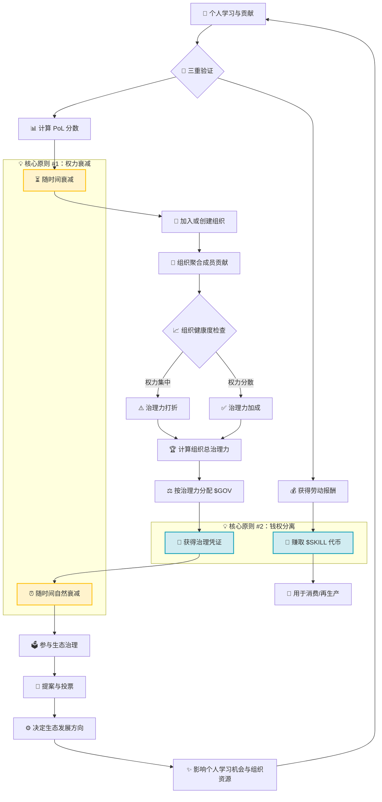

# Proof of Learning (PoL) 白皮书

**版本**：1.0   
**核心理念**：**让治理权跟随你的成长而流动。你此刻的学习与贡献，决定了你此刻的影响力。**

---

### **前言：为什么这份白皮书与你有关**

在现实社会与数字组织中，无论是社区、公司还是网络协作系统，都普遍面临一种结构性困境：  
在需要作出关键决策时，决策权往往长期集中于**历史地位较高或资本投入较多的主体**，而非那些**对当前问题具有最新理解、或在现实中持续创造认知与实践价值的参与者**。

PoL提出：**在一个快速变化的世界里，我们应该将制定规则、引领方向的话语权（治理权），托付给什么样的人？**

### **PoL vs. PoW/PoS：共识机制的演进**

在系统阐述PoL机制之前，需要将其置于共识机制的谱系中进行对比分析，以阐明其核心创新点。PoW（工作量证明）、PoS（权益证明）与PoL（学习证明）均试图解决同一个根本性问题：**在去中心化系统中，权力与奖励的分配应基于何种机制？**

| 机制 | 核心回答 | 依赖的"不可伪造成本" | 常见批评 |
| :--- | :--- | :--- | :--- |
| **PoW (工作量证明)** | 基于物理能量消耗的量化 | **外部物理成本**（计算资源消耗） | 能源效率问题，可能导致算力集中化 |
| **PoS (权益证明)** | 基于经济资产质押的量化 | **内部经济成本**（资本锁定） | 财富集中效应，权力与资本的强关联 |
| **PoL (学习证明)** | 基于可验证学习与贡献的量化 | **内部认知成本**（时间与认知投入） | 可能产生低价值重复行为，需要设计有效的验证与激励机制 |

#### **根本差异：成本性质与激励方向的差异**

从制度设计的角度分析，三者的核心差异体现在**成本的性质**与**激励的方向**两个维度：

1.  **成本性质的差异**
    *   **PoW的成本具有外部性**：计算资源的消耗与系统安全性相关，但与外部社会价值创造缺乏直接关联。
    *   **PoS的成本具有内部经济性**：资本的锁定与系统安全性相关，但不直接产生知识增量或能力提升。
    *   **PoL的成本具有内部认知性**：时间与认知投入**直接转化为个体与组织的能力增量**。在此机制中，**成本与收益实现了统一**——认知投入所形成的知识资产具有持续价值，而非消耗性成本。

2.  **激励方向的差异**
    *   **PoW激励物理网络基础设施的维护**。
    *   **PoS激励经济资产价值的维护**。
    *   **PoL激励人类能力的提升与现实问题的解决**。

3.  **社会价值产出的差异**
    *   PoW/PoS主要贡献于**系统内部的安全性与稳定性**。
    *   PoL在保障系统安全运行的同时，**将激励机制直接关联到现实世界的能力发展与价值创造**。

**核心观点**：机制设计本身是中性的，关键在于制度安排。不完善的设计可能导致PoW产生能源集中化，PoS导致财富固化，同样也可能使PoL产生低价值重复行为。PoL协议的挑战与价值在于，通过系统性的数学设计（如后文的三重验证机制、时间衰减机制、健康度调节机制），将激励引导至**真实的能力增长**而非**表面的量化指标**。

由此，PoL给出的回答是：  
**治理权应当动态授予那些持续学习、持续进化，并能够将其认知成果有效转化为现实问题解决能力的个人与组织。**

该机制不仅涉及技术实现，更关乎数字世界中权力分配、价值认可与权利行使的制度设计。为确保规则执行的公正性与透明性，协议采用数学公式化的方式实现自动化的评估与分配机制。本文将以系统性的方式阐述这些机制。

---
### **PoL 的实践基础**

PoL 协议的核心模块与激励逻辑内嵌于现有生态系统：**Skillshop × LearningNav**。

- **Skillshop** 作为任务与价值交换平台，提供实践场景与经济价值流通机制。
- **LearningNav** 作为动态学习路径系统，提供学习内容引导与知识输入源。

PoL 协议将在 **"学习 → 实践 → 治理"** 的闭环中进行实证验证与参数校准。本文所描述的公式、验证机制与治理流程，将接受真实用户行为与市场反馈的检验。有效的治理协议设计需要基于真实需求与实践反馈进行迭代优化。

## **第一章：核心哲学与问题定义**

### **1.1 传统治理的结构性问题**

传统治理机制中存在权力固化的结构性问题：决策权长期集中于特定主体，导致新参与者难以获得话语权，系统缺乏动态调整能力，权力与责任出现分离。

### **1.2 PoL的核心机制：时间衰减与动态更新**

PoL机制的核心在于，治理权具有时间衰减特性，需要通过持续的认知贡献进行动态更新。其核心动力学方程如下：

```
核心公理：dP/dt = -λP + β · (dC/dt)
```

**公式解析**：
- **`dP/dt`**：表示权力随时间变化的瞬时速率。`dP/dt > 0` 表示权力增长，`dP/dt < 0` 表示权力衰减。
- **`-λP`**：**自然衰减项**。`λ`（lambda）为衰减常数，可理解为权力的半衰期参数。`P`为当前权力水平。该项确保了即使无新增贡献，权力也会按照固定衰减率`λ`随时间自然衰减。这是防止权力固化的核心机制。
- **`β · (dC/dt)`**：**动态更新项**。`dC/dt`表示认知贡献的瞬时速率（学习与价值创造的速率），`β`（beta）为转化效率系数。认知贡献速率越大，该项数值越大，权力更新的速率越快。

**机制含义**：该公式确保了权力的持续性与动态性。只有通过持续的认知贡献（`dC/dt > 0`）来抵消自然衰减（`-λP`），才能维持或提升权力水平。权力的分配与维持始终与当前表现水平相关。

---

## **PoL系统架构概览**

下文通过系统架构图阐述PoL机制的完整运转逻辑：



### 🎯 **快速理解要点**

1. **动态增长的正反馈循环**：
   - 认知贡献 → 获得经济回报与影响力
   - 影响力转化为治理权 → 参与规则制定  
   - 优化的规则 → 改善学习与实践环境

2. **核心设计原则**：
   - **时间衰减机制**：个人PoL分数与$GOV治理权均随时间自然衰减，需要持续贡献以维持
   - **价值与权力分离**：$SKILL（可交易的经济价值）与$GOV（不可交易的治理权）完全分离，无法相互转换

3. **三层架构体系**：
   - **执行层**：学习与实践的价值创造
   - **进化层**：组织协作与能力聚合
   - **合法性层**：治理权分配与规则制定

---

## **第二章：协议架构与分层模型**

**本章目标**：构建权力动态分配的三层架构，解决传统治理中权力固化的结构性问题。

**传统治理模式**：组织结构相对固定，权力分配基于历史地位与资历。新参与者难以获得话语权，即使其认知能力与实践能力优于既有决策者。组织层级固化，难以适应环境的快速变化。

**PoL治理模式**：权力在三个动态层级间流动：个体首先通过学习与价值创造证明能力，随后通过协作实现组织能力聚合，最终基于集体表现获得治理权。权力分配基于能力表现，而非静态职位。

PoL机制并非孤立设计，而是内嵌于真实的经济与社会活动。因此，协议采用三层架构设计，每一层对应认知与实践的自然循环过程。

### **2.1 第一层：执行层**

*   **功能定义**：由 **`LearningNav`（学习内容系统）** 和 **`Skillshop`（实践平台）** 构成。该层实现**技能学习向价值创造的转化**。例如，通过 LearningNav 获取前沿知识，在 Skillshop 中承接实际项目并获得经济回报。
*   **参与角色**：**学习者** 与 **价值创造者**。在该层，参与者通过学习掌握技能，并在市场机制中实现价值转化，获得 **`$SKILL`** 代币作为经济回报。

### **2.2 第二层：进化层**

*   **功能定义**：评估个体如何组成**组织（DAO）**，以及组织作为整体是否在复杂挑战中实现能力升级、产生卓越成果。
*   **参与角色**：**协作者** 与 **组织建设者**。个体贡献在该层聚合，评估重点在于组织是否实现协同效应（1+1>2），是否作为有机整体实现能力进化。

### **2.3 第三层：合法性层**

*   **功能定义**：**PoL协议的核心层**。基于前两层的数据，回答："根据个体与组织近期的学习与协作成果，谁在当前阶段最有资格参与生态顶层决策？"
*   **参与角色**：**治理者**。系统根据表现授予不可交易、具有时间有效性的治理凭证 **`$GOV`**，代表投票权与提案权。

**数据来源**：在 Skillshop 完成的任务、在 LearningNav 的学习轨迹以及由此形成的协作网络，是 PoL 协议计算个人贡献（`Sᵢ(t)`）和组织健康度（`Hⱼ`）的**主要数据源**。PoL 的治理权力分配直接基于在现有产品中创造的真实价值。

**三层关系**：**执行层**的贡献产生经济价值（`$SKILL`），贡献记录影响**进化层**的组织参与资格，组织的整体表现与个体贡献共同决定**合法性层**的治理权分配（`$GOV`）。

**PoL采用三层架构设计，将理论框架转化为可运行的系统。数据在三层间流动与转化。**

### **2.4 三层架构与数据流**

数据流动遵循以下关系：
```
个人学习流：Lᵢ(t) = ∫ [α·Q(τ) - δ·Lᵢ(τ)] dτ
组织进化流：Eⱼ(t) = f( Σ wᵢ·Lᵢ(t), H_org )
治理权力流：Pⱼ(t) = γ(t) · Eⱼ(t) · e^{-λt}
```

**公式解析**：
1.  **个人层 (`Lᵢ(t)`)**: 个人知识存量的动态积累。`α·Q(τ)`表示通过学习质量`Q`的输入增量，`δ·Lᵢ(τ)`表示知识遗忘或过时的自然衰减。积分∫表示知识存量的累积过程。
2.  **组织层 (`Eⱼ(t)`)**: 组织的进化能力`E`，是成员个人知识`Lᵢ`的加权和(`Σ wᵢ·Lᵢ`)，经过健康度函数`f`的调节。`H_org`（详见后文）表示组织权力分布的均匀程度（健康度指标）。
3.  **治理层 (`Pⱼ(t)`)**: 组织获得的治理权力`P`，是其进化力`E`与资源分配系数`γ(t)`的乘积，再乘以时间衰减因子`e^{-λt}`。即使组织能力强，如无持续产出，权力也会衰减。

**机制含义**：个体学习（`Lᵢ`）构成组织能力（`Eⱼ`）的基础，组织能力是获得治理权（`Pⱼ`）的前提。形成从"个体学习"到"组织协作"再到"治理参与"的完整价值链条，每一环节均内置时间衰减机制(`e^{-λt}`)以防止系统僵化。

---

## **第三章：个人学习证明机制**

PoL机制不依赖学习时长的简单累计或证书的累积。协议设计 **"三重验证机制"** 以识别有效的学习：

### **3.1 三重验证框架**

1.  **输入质量评估**
    *   学习内容或任务的挑战性水平
    *   知识的前沿性与时效性

2.  **转化过程验证**
    *   能否展示从知识到技能的应用过程
    *   *例如：项目笔记、代码迭代记录、设计方案草稿。*

3.  **现实价值验证**
    *   **该环节为核心验证机制。** 学习成果是否在 `Skillshop` 中**解决实际问题并产生具体价值**？
    *   这是 **"学习证明"** 的最终验证标准。在 Skillshop 完成的任务评价、交付物与产生的经济价值，是该验证机制的核心输入数据。

### **3.2 个人学习力分数计算模型**

分数 = （初始加成系数）× ∑（近期任务成果 × 任务难度 × 成果可信度）


#### **公式解析**

*   **初始加成系数**
    *   初始加成可能来自导师指导、教育背景或历史记录。PoL机制承认这种初始差异，但其影响**随时间与努力程度衰减**。

*   **近期成果的加权累计**
    *   系统评估重点在于**最近时间段**的贡献。
    *   任务难度越高、验证可信度越高，单次得分越高。

*   **防低价值重复机制**
    *   系统通过算法设计，识别并抑制机械式重复行为、挂机行为、AI工具代劳等低价值贡献。
    *   **设计目标**：确保分数反映**真实的能力增长**，而非机械操作。
    
#### **AI工具使用的验证场景**

**场景示例**：如果仅使用 ChatGPT 等 AI 工具生成代码或文本，但未在 Skillshop 中承接实际任务、未产生经济交易、未解决具体用户问题或需求，系统将判定为"无效学习或虚假贡献"。在此场景下，无论 AI 生成多少内容，对应的 **`$SKILL` 经济报酬与 `$GOV` 治理凭证收益均为 0**。因为 PoL 的第三重验证——现实价值验证——要求学习成果必须在真实市场（Skillshop）中得到验证，解决具体问题并产生可观测价值。

PoL采用量化公式评估个人贡献，确保评估机制的公平性。

```
Sᵢ(t) = [ L₀ᵢ · e^{-λₐ·Aᵢ(t)} ] × [ Σ Dₖ·Vₖ·e^{-λₜ·(t-tₖ)} ]
```

该公式由两部分相乘组成：
- **第一部分 `[ L₀ᵢ · e^{-λₐ·Aᵢ(t)} ]`：初始加成系数**
    - `L₀ᵢ`：初始加成，可能来自导师指导、教育背景或历史优秀记录。
    - `e^{-λₐ·Aᵢ(t)}`：**不活跃衰减机制**。`Aᵢ(t)`表示无活跃行为（学习或贡献）的时间长度。不活跃时间越长，该系数衰减越快(`e^{-λₐ·Aᵢ}`)。初始加成的价值会随时间衰减，需要持续努力以维持。
- **第二部分 `[ Σ Dₖ·Vₖ·e^{-λₜ·(t-tₖ)} ]`：近期贡献加权累计**
    - `Σ`：对近期所有任务成果求和。
    - `Dₖ`：第k个任务的**难度系数**。任务挑战性越大，权重越高。
    - `Vₖ`：成果的**验证分数**（0-1），由预言机或社区评审给出，表示可信度。
    - `e^{-λₜ·(t-tₖ)}`：**时间衰减因子**。`(t-tₖ)`表示成果距今的时间。历史贡献的影响力随时间衰减，系统更重视**近期**表现。

**机制含义**：分数不依赖历史资历的累积，而基于近期高难度、高可信度的成果。公式设计促使参与者持续挑战，因为依赖初始加成或历史成果均因衰减机制而不可持续。

---

## **第四章：组织级治理力聚合**

现代社会的成就多源于协作而非个体行为。PoL机制不仅评估个体贡献，更系统性评估组织表现，确保组织健康度高的团队获得更大的影响力。

### **4.1 组织健康度评估与治理力公式**

组织的总影响力不等于成员个体影响力的简单加总。PoL通过引入 **"健康度系数"** 进行调节：权力过度集中的组织会被**降低权重**，而权力分布均匀、成员共同发展的组织则会获得**加权提升**。

#### **治理力计算公式**
```
Gⱼ(t) = [ Σ Sᵢ(t) ] × [ 1 + η·(1 - Hⱼ) ]^{-1}
Hⱼ = Σ ( Sᵢ(t) / Σ Sₖ(t) )²
```

#### **公式解析**
*   **`Gⱼ(t)`**：组织 `j` 的总治理力。
*   **`[ Σ Sᵢ(t) ]`**：所有成员个人PoL分数 `Sᵢ` 的简单加总，表示原始合力。
*   **`Hⱼ`**：**赫芬达尔-赫希曼指数**，衡量组织内权力集中度。
    *   计算方法：将每个成员的权力份额平方后求和。
    *   **`Hⱼ` 越接近 `1`**：权力越集中于极少数人（高度集中）。
    *   **`Hⱼ` 越接近 `0`**：权力分布越均匀（分散化）。
*   **`[ 1 + η·(1 - Hⱼ) ]^{-1}`**：**健康度调节器**（`η` 为**团队协同效应系数**）。权力分布越均匀（`Hⱼ`越小），该调节器的放大效果越强，体现团队成员间的协同效应（1+1>2）。
    *   当 `Hⱼ` 很大（权力集中）时，此调节器值 **≈ 1**，组织总治理力等于原始合力，**无加成**。
    *   当 `Hⱼ` 很小（权力分散）时，此调节器值 **< 1**，组织总治理力**被放大**。权力集中的组织则**权重降低**。

#### **机制含义**
该公式从制度设计上**激励去中心化的团队协作**。表明团队要提升集体影响力，需**促进每位成员的能力发展**，实现权力分散的健康状态，而非权力集中。

### **4.2 动态衰减机制：权力规模与维持成本的关系**

为防止组织（特别是大型组织）僵化，PoL设定核心机制：**组织的影响力越大，维持影响力所需的努力成本越高。**

#### **动态衰减公式**
```
λⱼ = λ₀ · ( 1 + β · Gⱼ(t)/Ḡ(t) )
```

#### **公式解析**
*   **`λⱼ`**：组织 `j` 的**实际衰减常数**（权力流失速率）。
*   **`λ₀`**：全系统**基础衰减率**（基础半衰期的倒数）。
*   **`β`**：负担调节系数。
*   **`Gⱼ(t)/Ḡ(t)`**：组织治理力与全网络组织中位数治理力的**比值**。
*   **核心机制**：当组织治理力 `Gⱼ` 远高于中位数 `Ḡ` 时，比值增大，导致 **`λⱼ` 远大于 `λ₀`**。这意味着**治理力高的组织维持权力所需的努力频率与强度必须远超普通组织**。

#### **机制含义**
该机制体现**权力规模与维持成本的对应关系**。
*   **对小规模组织**：完成一项有价值的创新即可维持影响力。
*   **对大规模组织**：必须持续取得更大突破、承担更复杂的项目。
该机制促使所有组织必须**保持持续进化状态**，否则影响力将加速衰减，从而有效防止垄断与官僚僵化。

---

## **第五章：博弈论与安全模型**

PoL不假设参与者均为理性合作者，而是预设各种可能的恶意行为，并通过规则设计使得恶意行为在长期看来**收益为负**，使合作成为理性选择。

### **5.1 核心防御机制**

PoL通过以下机制构建安全防线：

| 防御目标 | 具体策略 | 制度设计原则 |
|---------|---------|---------|
| 防止虚假学习证明 | 三重验证机制（输入质量、转化证据、现实输出） | 从源头识别有效学习 |
| 防止权力固化 | 时间衰减机制（`e^{-λt}`） | 权力需要持续更新 |
| 防止组织垄断 | 健康度系数调节、凹函数资源分配 | 奖励分散化，惩罚集中化 |
| 防止恶意挑战 | 不对称收益函数 | 大规模组织的挑战成本递增 |

### **5.2 关键数学模型与公式**

#### **5.2.1 预言机信任模型**
预言机（数据验证者）的信任分数采用动态更新机制，旨在激励长期、可靠的行为。

```
Tₒ(t) = Tₒ(t-1) · (1-ε) + (Correctₒ / Totalₒ) · ε
```

**公式解析**：
- **`Tₒ(t)`**：预言机在时刻 `t` 的**实时信任分数**。
- **`Tₒ(t-1) · (1-ε)`**：历史信任分的**缓慢衰减**。`ε` 为更新系数，确保历史信誉随时间衰减，避免一劳永逸。
- **`(Correctₒ / Totalₒ) · ε`**：基于**近期工作准确率**的快速更新。`Correctₒ/Totalₒ` 表示验证任务的正确率。

**设计含义**：
- **低质量行为将被淘汰**：如持续出错或消极工作，准确率下降，信任分将持续衰减至低于系统阈值，最终被自动移除出预言机网络。
- **激励长期可靠性**：只有保持高准确率，才能维持高信任分及相关权益与收益。

#### **5.2.2 挑战博弈的收益函数**
为防止恶意挑战，系统设计不对称收益函数，使挑战者的收益/损失与其系统地位关联。

```
U_challenge = {
    +R_reward,                  // 挑战成功，证实虚假
    -C_stake · (1 + G_challenger/Ḡ) // 挑战失败，惩罚成本
}
```

**公式解析**：
- **`+R_reward`**：挑战成功（证实被挑战方造假）时，获得奖励 `R_reward`。
- **`-C_stake · (1 + G_challenger/Ḡ)`**：挑战失败（诬告）时的惩罚。
    - **`C_stake`**：基础质押惩罚。
    - **`G_challenger/Ḡ`**：**关键调节因子**。`G_challenger` 为挑战者自身的治理力，`Ḡ` 为全网络组织中位数治理力。
    - **`(1 + G_challenger/Ḡ)`**：治理力越大的组织（`G_challenger` 越大），发起诬告失败时的惩罚被**放大**。

**设计含义**：
- **保护小规模组织**：治理力小的组织（`G_challenger/Ḡ` 小）发起挑战的失败成本相对较低，鼓励其对大规模组织进行监督。
- **约束大规模组织**：治理力大的组织（`G_challenger/Ḡ` 大）如滥用挑战权，将面临**高额失败成本**，迫使其谨慎使用。
- **确保机制公正性**：该机制从博弈论角度平衡大小组织间的权力，使挑战机制成为公正的社区监督工具，而非攻击手段。

**制度设计原则**：PoL认为，有效的制度设计不是试图消除恶意行为，而是通过规则设计**改变博弈的收益结构**，使恶意行为在经济学上不理性，使合作与诚实成为可持续的理性选择。

---

# **第六章：经济模型与代币机制**

PoL的核心设计之一是将 **"经济价值"** 和 **"治理权力"** 完全分离，防止经济资本转化为治理权力，确保努力获得公正回报。

## **6.1 双代币系统：核心定义与流通**

| | **$SKILL (技能代币)** | **$GOV (治理凭证)** |
| :--- | :--- | :--- |
| **功能定义** | **经济价值载体**。在 Skillshop 中流通的主要媒介。 | **治理权凭证** |
| **获取方式** | 在 **`Skillshop`** 完成工作获得报酬 | 通过持续学习与有效贡献（主要数据来自 Skillshop & LearningNav），由系统授予 |
| **使用范围** | 支付费用、购买服务、兑换实物——**用于消费与再生产** | 对生态提案投票、参与关键决策——**用于规划与治理** |
| **关键特性** | **可自由交易**，代表市场对技能价值的认可 | **不可交易、有时间有效性**，代表社区对当前判断力的信任 |

### **核心原则**
1.  **$SKILL 与 $GOV 无法相互转换**：经济价值无法直接转化为治理权力。**权力必须通过贡献获得**。
2.  **$GOV 不具资产属性**：治理权无法直接变现。**它是责任，而非资产**。

该设计确保参与决策的主体是那些深度参与、持续贡献的 **核心参与者**，而非 **外部资本方**。

---

## **6.2 双代币系统的数学定义**

### **$SKILL 代币 (ERC-20) 流通方程**
```
dM_SKILL/dt = ρ·V(t) - δ_burn·T_fee(t) + I_strategic(t)
               ↑ 经济活动注入      ↑ 通缩燃烧        ↑ 战略投放
```

**参数解析**：
- **`V(t)`**：`Skillshop` 平台总交易额（真实经济活动的度量指标）。
- **`ρ`**：代币铸造比率（例如 `0.01`），将经济活动与代币发行关联。
- **`T_fee(t)`**：平台手续费。
- **`δ_burn`**：燃烧比例（例如 `0.3`），部分手续费被永久销毁，产生通缩效应。
- **`I_strategic(t)`**：用于生态建设、激励等的战略投放。

### **$GOV 凭证 (SBT) 的铸造与衰减**
**铸造条件**：
```
MintGov_i(t) = { 1  if S_i(t) ≥ Θ_threshold AND t - t_lastGov ≥ Δ_epoch
                 0  otherwise }
```
*（仅当个人 PoL 分数 `S_i(t)` 达到阈值 `Θ_threshold`，且距上次获得 $GOV 已过一个周期 `Δ_epoch` 时，才能铸造新的 $GOV。）*

**衰减机制**：
```
GovPower_i(t) = GovPower_i(t₀) · e^{-λ_g · (t-t₀)} // λ_g 是治理权的"半衰期"常数
```
*（$GOV 权重随时间 `t` 自然指数衰减，衰减率为 `λ_g`。必须通过持续贡献获得新的 $GOV 以维持影响力。）*

---

## **6.3 凹函数资源分配模型**

组织 `j` 从生态金库获得资源（如资助、分红）的分配权重 `γⱼ`，由以下**凹函数**决定：
```
γⱼ(t) = min( γ_max, log( 1 + Gⱼ(t)/μ_G(t) ) )
```

**公式解析**：
- **`Gⱼ(t)/μ_G(t)`**：组织治理力 `Gⱼ` 与全网络组织中位数治理力 `μ_G` 的**比值**。
- **`log(...)`**：**对数函数**产生**边际效用递减**效应。
    - 组织从弱小成长到中等时，`log` 函数增长较快，资源奖励增长明显。
    - 组织成为大规模组织时，获得同等幅度额外奖励需付出**指数级增长**的努力。
- **`min(γ_max, ...)`**：确保奖励存在上限 `γ_max`（例如 `3.0`），防止极端情况。

**设计含义**：该模型**有效保护中小型创新团队**，防止资源被头部组织垄断，促进生态多样性。

### **一个反直觉的案例**

为了更直观地理解凹函数的效果，可以设想这样一个情景：**在 PoL 的世界里，一个已经拥有 1000 名成员、治理力排名第一的大公会，如果想要从生态金库中再多获得 10% 的资源分配，它可能需要创造出比 10 个初创小团队（每个团队约 10 人）在过去一年所取得的所有创新成果加起来还要大 5 倍的价值。** 这种指数级增长的"努力成本"，正是对数函数（`log`）创造的"边际效用递减"效应，它从数学上确保了"防止垄断"不是一句空话，而是刻在分配规则里的铁律。

---

## **6.4 学习资本机制**

学习资本 `Cᵢ` 的动力学方程描述了其如何流动：
```
dCᵢ/dt = α·Reputationᵢ(t) - Σ Cost_learning,k - δ_c·Cᵢ(t)
           ↑ 信用额度注入     ↑ 学习行为消耗    ↑ 自然贬值
```

**关键特性**：
1.  **非资产性**：学习资本 `Cᵢ` 会随时间自然贬值（`δ_c·Cᵢ(t)`），它不是可囤积的财富。
2.  **表现激活**：需要实际的学习投入（`Σ Cost_learning,k`）才能使用，不能闲置。
3.  **风险共担**：学习可能失败，系统允许部分资本豁免，但会影响未来的信用额度（`Reputationᵢ(t)`），形成可记录的信用历史。

---

# **第七章：突破性贡献奖励机制**

为防止系统在防止垄断后陷入保守、缺乏创新的状态，PoL设立**突破性贡献奖励**机制。

该机制旨在奖励**范式转变的质变**，而非工作量的简单累积，旨在生态中培养创新文化，确保系统拥有持续进化的核心驱动力。

## **7.1 突破识别算法**

突破的识别不基于成果总量，而是评估其**新颖性、效率与风险承担**。

### **突破指数公式**
```
Bⱼ(t) = (Noveltyⱼ / Novelty_global) × (Impactⱼ / Effortⱼ) × (Riskⱼ / Risk_avg)
```

### **公式解读（三项核心比率）**
| 比率 | 计算方式 | 衡量的价值 |
| :--- | :--- | :--- |
| **新颖性比率** | `你的成果新颖度 / 全网平均新颖度` | 成果的**独特性**。是否开辟了新领域，提出了前所未有的解决方案？ |
| **影响力效率** | `你的成果影响力 / 你所投入的努力` | 成果的 **“性价比”** 。是否以更聪明的路径取得了“四两拨千斤”的效果？ |
| **风险承担比率** | `你承担的风险 / 全网平均风险` | 行动的**勇气**。是否敢于进入无人区，承担远超常人的失败风险？ |

**设计原则**：系统重奖那些**采用高效方法、在创新领域、承担高风险**并取得重大影响的贡献。

## **7.2 三类突破奖励**

当组织的突破指数 `Bⱼ(t)` 持续超过阈值 `Θ_breakthrough` 时，有资格获得以下一种或多种奖励：

### **A. 范式定义权**
获得为你所开拓的**新领域制定初始规则**的临时特权（有效期 `τ_A`）。

**权重计算**：
```
W_paradigm = min( 1.0, Bⱼ(t) / Θ_breakthrough )
```
*（你的突破指数越高，获得的定义权重就越大，但不超过100%。）*

### **B. 文明遗产NFT**
将突破性贡献永久铭刻在生态历史中。这是最高荣誉，不可交易。

**铸造条件**：
```
MintLegacyNFT = true  IF  ∫ Bⱼ(t) dt > Γ_legacy
                  （在时间窗口T内，突破指数的累积值超过遗产阈值Γ_legacy）
```

### **C. 风险豁免机制**
为鼓励探索，为高风险失败提供风险缓解机制。

**发放概率**：
```
P_waiver = 1 - exp( -LostGov_historical / κ )
```
*（其中 `LostGov_historical` 是该组织历史上因高风险探索失败而损失的 `$GOV` 总量，`κ` 为调节参数。）*
- **设计逻辑**：为探索付出真实代价（损失了 `$GOV`）的组织，未来更可能获得风险豁免，体现系统对"有价值的失败"的包容性。

## **7.3 激励相容性**

奖励系统必须确保 **“追求突破是理性参与者的最优策略”**。

### **命题**
在合理参数设置下，突破奖励系统满足**激励相容**条件。

### **证明（简化的博弈论分析）**
构造一个组织的效用函数 `Uⱼ`：
```
Uⱼ = [γⱼ·R_resource] + [Σ(Iₖ·Vₖ)] - [C(Effortⱼ)]
        ↑ 常规资源收益    ↑ 突破奖励期望     ↑ 努力成本
```
- **`γⱼ·R_resource`**：通过常规治理活动获得的资源收益（来自第5章的凹函数分配）。
- **`Σ(Iₖ·Vₖ)`**：追求突破可能带来的三类奖励 (`k ∈ {A, B, C}`) 的**期望价值**。`Iₖ` 是获得奖励的指示函数，`Vₖ` 是奖励的价值。
- **`C(Effortⱼ)`**：为取得成果所付出的努力成本，通常随努力程度递增。

**一阶条件分析表明**：当突破奖励的价值 `Vₖ` 设计得足够大（即有足够吸引力），且触发条件 `Iₖ` 合理（即目标明确、可达）时，组织投入额外努力 (`Effortⱼ`) 去追求突破所获得的**边际收益**，将超过其**边际成本**。因此，**追求突破性成果将成为其理性上的最优策略**。

**结论**：该机制不仅奖励成功，更奖励**承担高风险的探索行为**，从制度设计上激励整个生态不断挑战认知边界，实现范式转变。

---

# **第八章：潜在挑战与应对**

任何创新协议在实施过程中都会面临现实挑战。PoL设计团队预先识别了以下关键问题及其应对策略。

## **8.1 初期冷启动问题**

**挑战**：如何吸引第一批高质量的贡献者和验证者？一个空荡的 `Skillshop` 和缺乏可信数据的预言机网络将无法运转。

**应对思路**：
*   **创世引导期**：设计一个有限的"创世引导期"，在此期间：
    *   邀请公认的专家、资深社区建设者作为**创世验证者**，以其声誉作为初始信任锚。
    *   发布一系列由生态基金资助的 **"创世任务"** ，提供有吸引力的 `$SKILL` 激励，吸引早期贡献者。
    *   对早期参与的组织和个人给予适度的 **"先驱者加成"**（随时间衰减），以奖励其承担早期不确定性风险。
*   **渐进式去中心化**：随着数据积累和社区壮大，逐步降低创世验证者的权重，将验证权力过渡给由算法和社区信誉筛选出的新验证者。

## **8.2 评估的主观性与官僚化风险**

**挑战**：如何防止"验证"本身变成一个僵化的官僚机构，或形成新的"学术门户之见"，排斥非主流但可能具有突破性的贡献？

**应对思路**：
*   **算法辅助，减少人为干预**：尽可能将验证标准（如代码质量、项目完成度、用户反馈数据）量化，由算法进行初步筛选，人类验证者更多扮演仲裁争议和评估"软性"创新价值的角色。
*   **社区挑战机制**：允许任何持有 `$GOV` 的参与者对验证结果提出挑战（需质押 `$SKILL`）。挑战成功将获得奖励，失败则损失质押。这利用群体智慧对验证者形成制衡。
*   **动态信誉与淘汰**：严格执行 **"预言机信任模型"（公式 5.2.1）**。验证者的权力完全取决于其长期、准确的记录。一旦准确率下降或行为出现偏差，其信任分将快速衰减并被系统自动边缘化。

## **8.3 "内卷"与过度竞争风险**

**挑战**：系统强调"近期贡献"（`e^{-λₜ·(t-tₖ)}`），会否导致参与者只追求短平快、易量化的任务，而不愿从事周期长、不确定性高但可能具有深远意义的基础性工作？

**应对思路**：
*   **长期价值标识**：在任务难度系数 `Dₖ` 和成果验证 `Vₖ` 的设计中，明确为 **"长期性"、"基础性"** 和 **"高风险探索性"** 工作设置特殊的标识和更高的权重系数。
*   **里程碑式奖励**：对于长期项目，设置中途里程碑，允许贡献者在每个里程碑完成后即时获得部分 `$SKILL` 和 PoL 分数奖励，以缓解其短期压力。
*   **文明突破奖励的平衡**：**第七章的突破奖励机制**正是为了对冲此风险。它为长期、高风险、可能失败但具有范式潜力的工作提供了获得超额回报的可能性，从激励结构上鼓励"仰望星空"。

## **8.4 与现实世界法律、教育的衔接**

**挑战**：PoL分数如何与传统学历、职业认证互动？其治理权分配机制是否会与现有法律框架（如公司法人治理）产生冲突？

**应对思路**：
*   **补充而非替代**：在现阶段，PoL应定位为传统体系的**补充证明**。它可以作为个人持续学习能力和项目经验的有力证据，用于求职、社区内资源分配等场景，但并非要立即取代法律认可的学位或执业资格。
*   **渐进式融合探索**：可与前瞻性的教育机构、企业合作，开展"微认证"或"技能护照"试点，将PoL分数作为其内部晋升、项目组队的参考之一。
*   **法律实体隔离**：在协议设计上，PoL驱动的治理活动（如生态提案投票）应明确作用于**该数字生态内部**的资源分配与规则制定。若涉及与现实世界资产或法律实体相关的决策，应设计合规的接口或委托给受法律认可的实体执行，确保权责清晰。

**核心态度**：PoL是一个生长于数字世界的原生协议，它的价值将首先在愿意采纳其规则的数字社群中得以验证。与现实世界的衔接是一个需要长期探索、谨慎推进的过程。

### **迈向实践：从 Skillshop × LearningNav 开始**

PoL 协议的第一个完整闭环将在 **Skillshop × LearningNav** 生态内实现。这意味着，本章讨论的所有潜在挑战（冷启动、评估风险、低价值重复等）将在该产品矩阵的真实用户行为、任务市场与协作网络中，获得实证数据与迭代反馈。协议参数（如衰减率λ、健康度奖励系数η、突破阈值Θ等）将通过治理提案，由社区根据实际运行效果动态调整。

---

# **第九章：长期愿景与文明意义**

**前言**

> PoL是一个**社会实验性协议**。本文所描述的长期愿景具有探索性质，并非定论。我们并不假定PoL能解决所有治理问题，它可能存在尚未识别的缺陷与局限。
>
> 本文旨在提供一个**可验证、可演化的基础框架**。其核心价值在于，将所有规则与权力分配逻辑编码为公开、可审计的数学公式，使得任何结果都可以追溯和检验。这为治理模式的迭代提供了清晰的基准。
> **Skillshop × LearningNav** 是选定的第一个实践平台。理论将通过实践验证，公式将接受市场检验。
> 我们以开放的态度，邀请对治理模式感兴趣的参与者、研究者与批评者，共同测试、挑战、改进和完善该协议。实践与社区反馈将成为协议发展的最终依据。

## **9.1 PoL作为数字合约**

PoL协议不仅仅是一个技术系统，它尝试成为**数字时代的社会运行基础**，明确了新范式的核心原则：

*   **权力来源**：只能来自**持续的学习与贡献**。
*   **权力限制**：必须**随时间衰减**，无行为则失效。
*   **代际关系**：**尊重传承**但**拒绝世袭特权**。
*   **突破奖励**：**鼓励承担风险**以推动文明进步。

**在PoL规则驱动的社群中**：
*   安全感主要来自**学习能力**，而非资产积累。
*   尊重获得方式基于**最近的创造与贡献**，而非历史地位。
*   系统活力源于个体**持续成长**的聚合效应。

## **9.2 三个文明级预测**

| 预测 | 内容 | 潜在影响 |
| :--- | :--- | :--- |
| **预测1：治理权力的范式转移** | 未来10年，主要DAO将采用类似PoL的**合法性验证机制**，替代简单的代币投票。 | 治理从“资本加权”转向“贡献加权”，更加公平和高效。 |
| **预测2：学习证明的标准化** | PoL分数可能成为Web3时代的 **“认知信用评分”** 。 | 用于**跨平台协作信用**、**治理资格互认**和**资源分配依据**。 |
| **预测3：数字文明的进化加速** | 通过将治理权分配给 **“仍在学习的人”** ，系统的进化速度将提高一个数量级。 | 社区和组织将具备更快的适应能力和创新能力。 |

## **9.3 最终数学宣言**

文明的进化速度，可以用一个方程来描述：

```
dCivilization/dt = α · Σ [ Gⱼ(t) · Healthⱼ(t) · (1 + β·Bⱼ(t)) ]
```

**方程解析**：
*   **`dCivilization/dt`**：**文明进化速度**。
*   **`Gⱼ(t)`**：组织的治理力（来自公式 `(4.1)`），表示其**当前的综合能力**。
*   **`Healthⱼ(t)`**：组织健康度（与公式 `(4.1)` 中的权力分布 `Hⱼ` 相关），表示其**内部协作的公平性与效率**。
*   **`Bⱼ(t)`**：突破指数（来自公式 `(7.1)`），表示其**推动范式转变的潜力**。
*   **`α, β`**：调节系数。

**核心结论**：文明的进步不取决于历史财富或权力，而取决于**最活跃、最健康、最具创新性的组织**的集体表现。PoL协议旨在通过代码与数学将这一理念转化为可运行的系统。

---

# **第十章：密码学与可验证性基础（Cryptographic Foundations of PoL）**

## **10.1 设计目标：为什么 PoL 需要密码学**

PoL 并不假设系统中的任何参与方（学习者、组织、验证者、平台）是天然可信的。  
因此，PoL 必须建立在 **“可验证而非可相信”** 的基础之上。

本章的目标是回答以下问题：

1. 学习与贡献记录如何**不可篡改**？
2. 在保护隐私的前提下，如何证明“我确实学过 / 做过 / 贡献过”？
3. 治理权的计算结果如何做到**可复算、可审计、可追责**？

PoL 采用**分层密码学结构**，而非单一链上证明，以平衡安全性、隐私性与工程可行性。

---

## **10.2 PoL 的密码学对象模型**

PoL 中引入以下核心密码学对象：

| 对象 | 符号 | 作用 |
|---|---|---|
| 学习承诺 | `Com_i` | 对学习与贡献数据的不可篡改承诺 |
| 学习证明 | `π_i` | 证明学习行为满足 PoL 规则 |
| 时间戳 | `τ` | 防止事后伪造与回滚 |
| 治理凭证 | `$GOV_i` | 基于可验证学习生成的治理权 |
| 验证密钥 | `vk` | 用于公开验证学习证明 |

---

## **10.3 学习承诺机制（PoL-Commitment）**

所有学习与贡献事件，首先被压缩为一个**加密承诺**：

```
Com_i = Hash(
    ID_i ∥ TaskID ∥ ArtifactHash ∥ Score_i ∥ τ
)
```

**参数说明**：
- `ID_i`：学习者或组织的去标识化身份
- `TaskID`：Skillshop / LearningNav 中的任务或学习单元
- `ArtifactHash`：代码、文档、交付物的哈希
- `Score_i`：对应的 PoL 分数或中间评分
- `τ`：链上或可信时间源时间戳

**安全性质**：
- **不可篡改性**：任何修改都会导致 `Com_i` 改变
- **最小披露**：原始内容无需公开，仅需哈希

---

## **10.4 PoL 学习证明（PoL-Proof）**

在需要主张治理权或挑战时，学习者需生成一个学习证明：

```
π_i = Prove(
    Com_i,
    Rules_PoL,
    Witness_i
)
```

其中：
- `Rules_PoL`：PoL 协议规则（对应第 3–5 章公式）
- `Witness_i`：私有学习路径、过程数据、原始证据

验证过程为：

```
Verify(vk, Com_i, π_i) = true / false
```

**关键性质**：
- 验证者无需知道你“学了什么”
- 只需确认：**你确实满足 PoL 的规则**

---

## **10.5 零知识学习证明（ZK-PoL）**

为防止学习过程被过度监控，PoL 原生支持零知识证明结构：

> **证明你“符合规则”，而不是暴露“学习细节”**

### **零知识断言示例**

```
∃ LearningPath_i :
    S_i(t) ≥ Θ_threshold
    ∧ 所有贡献满足三重验证
    ∧ 无虚假或重复行为
```

该断言在不披露具体内容的情况下完成验证。

**适用场景**：
- 治理投票资格验证
- 跨组织 / 跨平台 PoL 互认
- 合规场景下的最小信息披露

---

## **10.6 治理权的可验证铸造**

$GOV 的生成不依赖人工审批，而依赖可验证条件：

```
MintGov_i ⇐⇒ Verify(vk, Com_i, π_i) = true
             ∧ S_i(t) ≥ Θ_threshold
             ∧ t - t_last ≥ Δ_epoch
```

该逻辑确保：
- 治理权**只能由真实学习产生**
- 无法通过资本、转账或关系获得

---

## **10.7 抗伪造与抗合谋机制**

PoL 在密码学层面引入以下防御：

### **(1) 重复贡献抵抗**
```
∀ i,j :
ArtifactHash_i = ArtifactHash_j
⇒ Weight ↓
```

### **(2) 合谋惩罚放大**
若多个主体重复引用相同学习路径，其 PoL 权重将被指数级削弱。

### **(3) 时间绑定**
```
Com_i 必须在 τ_window 内提交
```
防止事后补交与回溯式造假。

---

## **10.8 PoL 的信任最小化原则**

PoL 的密码学设计遵循以下原则：

1. **不信任输入，只验证结果**
2. **不依赖平台诚实性**
3. **不要求永久身份**
4. **所有治理权皆可被数学复算**

---

## **10.9 与 PoL 全局公式的对应关系**

| 密码学组件 | 对应章节 |
|---|---|
| `Com_i` | 第 3 章（个人学习证明） |
| `π_i` | 第 5 章（安全与博弈） |
| ZK-PoL | 第 6–7 章（治理与突破） |
| `$GOV` 铸造 | 第 6 章（经济模型） |

---

## **10.10 本章总结**

PoL 不是“记录学习”，而是：

> **用密码学证明：谁在真实世界中持续成长，  
谁就应当在数字世界中拥有更大的治理权。**

密码学不是 PoL 的装饰，而是其**合法性基础**。


---
## **附录：公式索引与开发参考**

| 公式编号 | 名称 | 位置 | 核心用途 |
| :--- | :--- | :--- | :--- |
| **(1.2)** | 权力动力学方程 | 第1章 | 定义PoL核心哲学：权力衰减与持续贡献。 |
| **(3.2)** | 个人PoL分数 | 第3章 | 计算个人学习证明，量化近期贡献。 |
| **(4.1)** | 组织治理力 | 第4章 | 聚合个人贡献，并根据权力集中度进行健康度调节。 |
| **(4.2)** | 动态衰减常数 | 第4章 | 实现“权力越大，维持越难”的负担机制。 |
| **(5.2)** | 资源分配权重 | 第5章 | 通过凹函数分配生态资源，防止垄断。 |
| **(6.1)** | 预言机信任模型 | 第6章 | 建立可信任的数据验证机制，防止伪造。 |
| **(7.1)** | 突破指数 | 第7章 | 识别具有高新颖性、高效率和高风险的突破性成果。 |
| **(9.3)** | 文明进化方程 | 第9章 | 描述系统终极目标，将治理力、健康度与创新力关联。 |
| **(10.1)** | 学习承诺函数（PoL-Commitment） | 第10章 | 将学习与贡献压缩为不可篡改的加密承诺，用于后续验证与审计。 |
| **(10.2)** | 学习证明生成函数（PoL-Proof） | 第10章 | 证明学习行为满足 PoL 协议规则，而无需披露具体学习内容。 |
| **(10.3)** | 零知识学习断言（ZK-PoL） | 第10章 | 在保护隐私的前提下，验证学习成果与治理资格的合法性。 |
| **(10.4)** | 治理凭证铸造条件 | 第10章 | 基于可验证学习证明，自动生成不可交易的治理凭证 `$GOV`。 |
| **(10.5)** | 抗重复与抗合谋约束 | 第10章 | 防止重复提交、路径合谋与回溯式伪造学习行为。 |
| **(10.6)** | 密码学可验证性映射 | 第10章 | 将 PoL 的治理结果映射为可复算、可审计的密码学对象。 |


---
