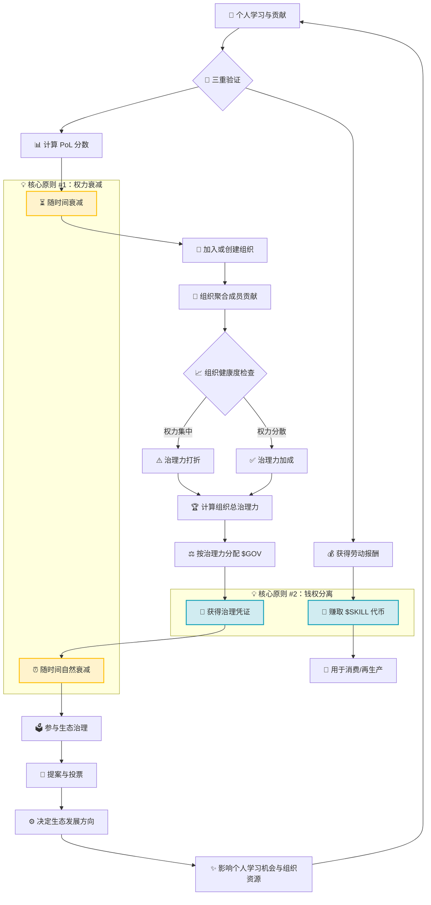

# Proof of Learning (PoL) 白皮书


**版本**：1.0   
**核心理念**：**让治理权跟随你的成长而流动。你此刻的学习与贡献，决定了你此刻的影响力。**

---

### **前言**

在现实社会与数字组织中，无论是社区、公司还是网络协作系统，都普遍面临一种结构性困境：  
在需要作出关键决策时，决策权往往长期集中于**历史地位较高或资本投入较多的主体**，而非那些**对当前问题具有最新理解、或在现实中持续创造认知与实践价值的参与者**。

PoL提出：**在一个快速变化的世界里，我们应该将制定规则、引领方向的话语权（治理权），托付给什么样的人？**

### **PoL vs. PoW/PoS：共识机制的演进**

在深入PoL之前，我们可以将其置于一个更广阔的共识机制谱系中来看，这将帮助你更快地理解其核心创新。PoW（工作量证明）、PoS（权益证明）与PoL（学习证明）都试图回答同一个根本问题：**在一个去中心化的系统中，谁值得获得更多的权力与奖励？**

| 机制 | 核心回答 | 依赖的"不可伪造成本" | 常见批评 |
| :--- | :--- | :--- | :--- |
| **PoW (工作量证明)** | 谁消耗了最多的物理能量（电力）？ | **外部物理成本**（烧电） | 能源浪费，易导致矿池垄断 |
| **PoS (权益证明)** | 谁抵押了最多的经济资产（代币）？ | **内部经济成本**（押钱） | "富者恒富"，权力资本化 |
| **PoL (学习证明)** | 谁进行了最有效、可验证的学习与贡献？ | **内部认知成本**（时间+精力） | 可能引发"刷题内卷"，需精细设计防作弊 |

#### **根本差异：成本与价值的统一**

更深入地看，三者的差异在于 **"成本的性质"** 和 **"激励的方向"**：

1.  **成本性质不同**
    *   **PoW的成本是外部的**：消耗的电力与系统安全相关，但与创造的社会价值无关。
    *   **PoS的成本是内部的（经济）**：锁定的资本与系统安全相关，但不直接产生新知识。
    *   **PoL的成本是内部的（认知）**：投入的时间与精力 **直接转化为个人和组织的真实能力提升**。这是唯一一种 **成本即收益本身** 的机制——你学到的东西不会归零，而是成为你永久的资产。

2.  **激励方向不同**
    *   **PoW激励维护物理网络**。
    *   **PoS激励维护经济资产价值**。
    *   **PoL激励提升人类能力与解决现实问题**。

3.  **社会价值不同**
    *   PoW/PoS主要贡献于**系统内部的安全与稳定**。
    *   PoL在保障系统运行的同时，**直接将激励导向现实世界的能力发展与价值创造**。

**核心洞见**：机制本身并无道德高低，关键在于设计。糟糕的设计会使PoW导致能源垄断，使PoS固化贫富差距，同样也可能使PoL陷入无效内卷。PoL协议的挑战与价值，正在于通过精巧的数学设计（如后文的三重验证、衰减机制、健康度调节），让激励流向 **"真实的成长"** 而非 **"表面的刷分"**。

由此，PoL给出的回答是：  
**治理权应当动态授予那些持续学习、持续进化，并能够将其认知成果有效转化为现实问题解决能力的个人与组织。**

它不仅关乎技术，更关乎你未来如何在数字世界中获得认可、行使权利并创造价值。为了确保这套规则的公正与透明，其背后有一套严谨的数学公式作为"自动裁判"。别担心，我们会用易懂的方式解释它们。

---
### **PoL 的实践土壤**

**PoL 不是一个"理论的空中楼阁"。** 它的核心模块与激励逻辑，已经内生于一个正在运行的生态系统：**Skillshop × LearningNav**。

- **Skillshop** 是任务与价值交换的市场，提供了 **"动手做"** 的场景和真实的经济活动流。
- **LearningNav** 是动态的学习路径与知识库，提供了 **"学什么"** 的引导和高质量输入源。

PoL 协议将首先在这个 **"学习 → 实践 → 治理"** 的闭环中进行实验与校准。这意味着，本文描述的所有公式、验证机制和治理流程，都将直接受到真实用户行为和市场反馈的检验与塑造。我们坚信，一个伟大的治理协议，必须从真实的需求和交互中生长出来。

## **第一章：核心哲学与问题定义——当"永久驾照"成为马路隐患**

### **1.1 我们都遇到的治理困局**

传统治理如同“永久驾照”，权力固化导致新人难出头、系统怕变化、权责脱节。

### **1.2 PoL的解决方案：给权力加上“保鲜期”与“充电桩”**

PoL认为，治理权应像手机电量，随时间自然流失（衰减），但可以通过持续有效的行动（贡献）为其充电。其核心思想由以下公式定义：

```
核心公理：dP/dt = -λP + β · (dC/dt)
```

**公式解读**：
- **`dP/dt`**：代表你 **“权力变化的瞬时速度”**。结果为“正”表示权力在增长，“负”表示在减少。
- **`-λP`**：这是 **"自然衰减项"**。`λ`(lambda)是**衰减常数**，你可以把它理解为权力的 **"半衰期"**（就像放射性元素一样）。`P`是你当前的权力。这意味着，即使你什么都不做，你的权力也会像放射性元素一样，按照一个固定的半衰期`λ`随时间自然衰减、消减。这是防止权力固化的核心。
- **`β · (dC/dt)`**：这是 **“充电项”**。`dC/dt`代表你 **“认知贡献的瞬时速度”**（即你此刻学习和创造价值的速率），`β`(beta)是转化效率。你学得越快、创造的价值越大，这项为正值且越大，就能为你的权力“电池”充入更多电量。

**对你的意义**：这个公式确保了 **"躺在功劳簿上吃老本"是行不通的**。你必须像给手机定期充电一样，通过持续的学习与贡献（`dC/dt > 0`）来对抗自然的权力衰减（`-λP`），才能维持甚至增长你的影响力。你的权力永远与你的当下表现挂钩。

---

## **PoL全景图：3分钟看懂运转逻辑**

在深入细节之前，让我们通过一个简单的流程图快速了解PoL系统的完整运转逻辑：



### 🎯 **快速理解要点**

1. **这是一个动态增长的飞轮系统**：
   - 你学习贡献 → 获得收益和影响力
   - 影响力带来治理权 → 参与制定规则  
   - 更好的规则 → 创造更好的学习与贡献环境

2. **两大核心原则**：
   - **⏳ 权力衰减**：个人PoL分数和$GOV治理权都会随时间自然减少，必须持续贡献才能维持
   - **💰/🔑 钱权分离**：$SKILL（可交易的经济报酬）与$GOV（不可交易的治理权）完全分离，无法相互兑换

3. **对应三层架构**：
   - **🌱→💰**：第一层（执行层）- "动手做"
   - **🤝→🏢**：第二层（进化层）- "团队战"
   - **🏆→🗳️**：第三层（合法性层）- "话语权"

---

## **第二章：协议架构与分层模型——一个三层"成长引擎"**

**本章目标**：解决"永久驾照"导致的系统僵化问题，建立让权力持续流动的三层架构。

**传统世界**：组织结构固定，权力按资历分配。新人难以获得话语权，即使他们的想法更好、技能更新。组织层级固化，难以适应快速变化的环境。

**PoL世界**：权力在三个动态层级间流动：你首先通过学习和创造价值证明自己，然后通过与志同道合者协作实现团队进化，最终基于集体表现获得治理话语权。权力不是静态的职位，而是流动的能力证明。

PoL不是一个孤立的概念，它需要扎根于真实的经济与社会活动。因此，它被设计为一个三层的"成长引擎"，每一层都对应着我们认知与实践的自然循环。

### **第一层：执行层（"动手做"的舞台）**
*   **是什么**：由 **`LearningNav`（学什么）** 和 **`Skillshop`（怎么用）** 组成。这是你**学习技能并将其转化为真实价值**的地方。就像你通过 LearningNav 找到前沿编程课程，学完后立刻在 Skillshop 承接一个开发项目并获得报酬。
*   **你的角色**：**学习者** 与 **价值创造者**。在这里，你的目标是在 LearningNav 引导下掌握硬技能，并在 Skillshop 的市场中将其兑现，赚取代表经济回报的 **`$SKILL`** 代币。

### **第二层：进化层（“团队战”的升级）**
*   **是什么**：衡量个人如何组成**团队（组织/DAO）**，以及团队作为一个整体，是否在复杂挑战中升级了能力、产生了更卓越的成果。
*   **你的角色**：**协作者** 与 **组织建设者**。个人贡献在这里汇聚，评估的重点是团队是否“1+1>2”，是否作为一个有机体在进化。

### **第三层：合法性层（"话语权"的授予）**
*   **是什么**：这就是**PoL协议的核心层**。它冷静地观察前两层的数据，并回答："根据你们（个人和组织）近期的学习和协作成果，谁在当下最有资格参与整个生态的顶层决策？"
*   **你的角色**：**治理者**。在这里，系统根据你的表现，授予你不可交易、但有"保鲜期"的治理凭证 **`$GOV`**，代表你暂时的投票权与提案权。

**与现有产品的对齐**：你在 Skillshop 完成的任务、在 LearningNav 的学习轨迹以及由此形成的协作网络，是 PoL 协议计算你个人贡献（`Sᵢ(t)`）和组织健康度（`Hⱼ`）的**主要数据源**。这意味着，PoL 的治理权力直接锚定于你在现有产品中创造的真实价值。

**三层关系**：就像一个游戏，你在**执行层**打怪升级赚金币（`$SKILL`），你的战绩帮助你加入更强的**进化层**公会，而公会的整体表现和你的贡献，最终决定你在**合法性层**能获得多少荣誉勋章（`$GOV`）来参与游戏规则的制定。

**PoL是一个三层"成长引擎"，将理念落地为可运行的体系。数据在这三层间流动和转化。**

### **三层架构与数据流**
数据流动遵循以下关系：
```
个人学习流：Lᵢ(t) = ∫ [α·Q(τ) - δ·Lᵢ(τ)] dτ
组织进化流：Eⱼ(t) = f( Σ wᵢ·Lᵢ(t), H_org )
治理权力流：Pⱼ(t) = γ(t) · Eⱼ(t) · e^{-λt}
```

**公式解读**：
1.  **个人层 (`Lᵢ(t)`)**: 你的个人知识存量像水池。`α·Q(τ)`代表通过学习(`Q`质量)注入活水，`δ·Lᵢ(τ)`代表知识遗忘或过时的自然流失。积分∫表示这是一个日积月累的过程。
2.  **组织层 (`Eⱼ(t)`)**: 组织的进化力`E`，是成员个人知识`Lᵢ`的加权和(`Σ wᵢ·Lᵢ`)，再经过一个健康度函数`f`的调节。`H_org`（后文详解）代表了组织权力分布的均匀程度（健康度）。
3.  **治理层 (`Pⱼ(t)`)**: 组织最终获得的治理权力`P`，是其进化力`E`乘以一个资源分配系数`γ(t)`，再乘以一个时间衰减因子`e^{-λt}`。这意味着即使组织能力再强，如果不持续产出，权力也会衰减。

**对你的意义**：你可以清晰地看到，你个人的学习（`Lᵢ`）是组织力量（`Eⱼ`）的基石，而组织力量是获得治理权（`Pⱼ`）的基础。这是一条从“我学到”到“我们做到”再到“我们有权决定”的完整价值链条，且每一环都内置了防僵化的衰减机制(`e^{-λt}`)。

---

## **第三章：个人学习证明机制——如何证明“你真的学会了”？**

PoL深知，单纯刷学习时长、囤积证书是无效的。它设计了一套 **“三重验证”** 来识别真实的学习：

### **三重验证框架**

1.  **学了啥？（输入质量）**
    *   课程或任务本身有挑战性吗？
    *   是前沿知识还是陈旧内容？

2.  **学会没？（转化证据）**
    *   你能展示从知识到技能的应用过程吗？
    *   *例如：项目笔记、代码迭代记录、设计方案草稿。*

3.  **有用吗？（现实输出）**
    *   **这是最关键的一环。** 你的学习最终在 `Skillshop` 中**解决了谁的实际问题？带来了什么具体成果？**
    *   这才是 **"学习证明"** 的终极证据。你在 Skillshop 完成的任务评价、交付物和产生的经济价值，是这部分验证的核心输入。

### **个人“学习力分数”计算（简化模型）**

你的分数 = （来自导师或传承的“起步助力”） × ∑（近期每次任务成果 × 任务难度 × 成果可信度）


#### **公式解读**

*   **“起步助力”**
    *   就像好的教育家庭能给你更好的学习环境，但不会替你考试。PoL尊重这种传承，但它的效果**会随时间和你是否努力而衰减**。

*   **核心是累加近期成果**
    *   系统最看重的是你 **“最近”** 做了什么。
    *   任务**越难**、验证**越可靠**，单次得分**越高**。

*   **防"刷分"设计**
    *   系统通过复杂的算法设计，能有效识别并抑制机械式刷题、挂机、利用AI代劳等行为。
    *   **核心目标**：确保分数反映的是 **"人的成长"** ，而非机械操作。
    
#### **一个具体的"AI对抗"场景**

**例如**：如果你只是让 ChatGPT 等 AI 工具为你生成了大量代码或文本，却没有在 Skillshop 中承接真实的任务、没有产生实际的经济交易、没有解决任何一个具体的用户 Bug 或需求，那么系统将判定该行为为"无效学习或虚假贡献"。在这种场景下，无论 AI 生成了多少内容，你对应的 **`$SKILL` 劳动报酬和 `$GOV` 治理凭证收益都将为 0**。因为 PoL 的第三重验证——"有用吗？（现实输出）"——要求你的学习成果必须在真实的市场中（Skillshop）得到验证，解决具体问题并产生可观测的价值。

PoL通过一个量化公式来评估个人贡献，确保公平。

```
Sᵢ(t) = [ L₀ᵢ · e^{-λₐ·Aᵢ(t)} ] × [ Σ Dₖ·Vₖ·e^{-λₜ·(t-tₖ)} ]
```

这个公式由两部分相乘组成：
- **第一部分 `[ L₀ᵢ · e^{-λₐ·Aᵢ(t)} ]`：传承启动器**
    - `L₀ᵢ`：你的初始加成，可能来自导师、家庭或过往优秀记录带来的“起步优势”。
    - `e^{-λₐ·Aᵢ(t)}`：这是一个**严厉的“不活跃惩罚”**。`Aᵢ(t)`是你多久没有活跃行为（学习或贡献）。只要你不活跃，这个启动器就会急速衰减(`e^{-λₐ·Aᵢ}`)。这意味着，前辈的荫蔽或过往荣光，如果你不努力，很快就会“过期”。
- **第二部分 `[ Σ Dₖ·Vₖ·e^{-λₜ·(t-tₖ)} ]`：近期表现核**
    - `Σ`：对近期所有任务成果求和。
    - `Dₖ`：第k个任务的**难度系数**。挑战越大，价值越高。
    - `Vₖ`：成果的**验证分数**（0-1），由预言机或社区评审给出，代表可信度。
    - `e^{-λₜ·(t-tₖ)}`：这是**时间衰减**。`(t-tₖ)`是成果距今的时间。再辉煌的过去贡献，其影响力也会随时间淡化，系统更看重你**最近**做了什么。

**对你的意义**：你的分数不靠“资历”累积，而靠“近期高难度、高可信度的成果”来获得。公式迫使你持续挑战自我，因为“啃老本”（依赖第一部分）和“吃老本”（依赖过去的成果）都因衰减项的存在而不可行。

---

## **第四章：组织级治理力聚合——为什么健康的团队更有力量**

个人英雄主义时代已经过去，现代社会的成就大多源于协作。PoL不仅衡量个人，更科学地衡量组织，确保健康的团队能获得更大影响力。

### **4.1 组织的“健康体检”与治理力公式**

一个组织的总影响力，不等于其成员个人影响力的简单相加。PoL通过引入 **“健康度系数”** 进行调节：权力过度集中的组织会被 **“打折”**，而权力分布均匀、成员共同成长的团队则会获得 **“加成”**。

#### **治理力计算公式**
```
Gⱼ(t) = [ Σ Sᵢ(t) ] × [ 1 + η·(1 - Hⱼ) ]^{-1}
Hⱼ = Σ ( Sᵢ(t) / Σ Sₖ(t) )²
```

#### **公式解读**
*   **`Gⱼ(t)`**：组织 `j` 的总治理力。
*   **`[ Σ Sᵢ(t) ]`**：所有成员个人PoL分数 `Sᵢ` 的简单加总，代表原始合力。
*   **`Hⱼ`**：**赫芬达尔-赫希曼指数**，衡量组织内权力集中度。
    *   计算方式：将每个成员的权力份额平方后求和。
    *   **`Hⱼ` 越接近 `1`**：权力越集中于极少数人（“一枝独秀”）。
    *   **`Hⱼ` 越接近 `0`**：权力分布越均匀（“群星闪耀”）。
*   **`[ 1 + η·(1 - Hⱼ) ]^{-1}`**：**健康度调节器**（`η` 为**团队默契加成系数**）。权力分布越均匀（`Hⱼ`越小），这个调节器的放大效果越强，如同团队成员间产生了"化学反应"，实现1+1>2。
    *   当 `Hⱼ` 很大（权力集中）时，此调节器值 **≈ 1**，组织总治理力几乎等于原始合力，**没有加成**。
    *   当 `Hⱼ` 很小（权力分散）时，此调节器值 **< 1**，组织总治理力会**被放大**。反之，权力集中的组织则会被**打折**。

#### **对你的意义**
此公式从制度上**鼓励去中心化的团队协作**。它明确告诉团队领袖：要提升团队的集体影响力，必须致力于**赋能每一位成员**，创造“群星闪耀”的健康状态，而非打造个人崇拜。

### **4.2 “权力越大，责任越大”的具象化：动态衰减公式**

为防止组织（尤其是大型组织）僵化，PoL设定了一条铁律：**组织的影响力越大，维持它所需付出的“努力成本”就越高。**

#### **动态衰减公式**
```
λⱼ = λ₀ · ( 1 + β · Gⱼ(t)/Ḡ(t) )
```

#### **公式解读**
*   **`λⱼ`**：组织 `j` 的**实际衰减常数**（权力流失速度）。
*   **`λ₀`**：全系统**基础衰减率**（基础"半衰期"的倒数）。
*   **`β`**：负担调节系数。
*   **`Gⱼ(t)/Ḡ(t)`**：组织治理力与全网组织中位数治理力的**比值**。
*   **核心机制**：当组织治理力 `Gⱼ` 远高于中位数 `Ḡ` 时，比值变大，导致 **`λⱼ` 远大于 `λ₀`**。这意味着**顶尖组织维持权力所需的“努力频率和强度”必须远超普通组织**。

#### **对你的意义**
这完美体现了 **“能力越大，责任越大”** 。
*   **对小团队**：完成一项有价值的创新就可能维持影响力。
*   **对大团队**：必须持续取得更大突破、承担更复杂项目。
这迫使所有组织都必须**保持饥饿感和进化状态**，否则影响力将加速流失，从而有效防止垄断与官僚僵化。

---

## **第五章：博弈论与安全模型——假设人性，设计制度**

PoL不假设参与者都是天使，而是预设了各种可能的"作弊"行为，并通过规则设计让作弊在长期看来 **"不划算"**，让善行成为最理性的选择。

### **5.1 核心防御机制**

PoL通过以下机制构建安全防线：

| 防御目标 | 具体策略 | 制度哲学 |
|---------|---------|---------|
| 防止虚假学习证明 | 三重验证机制（输入质量、转化证据、现实输出） | 从源头识别真实学习 |
| 防止权力固化 | 时间衰减机制（`e^{-λt}`） | 权力必须持续充电 |
| 防止组织垄断 | 健康度系数调节、凹函数资源分配 | 奖励分散，惩罚集中 |
| 防止恶意挑战 | 不对称收益函数 | 大组织挑战成本更高 |

### **5.2 关键数学模型与公式**

#### **5.2.1 预言机信任模型**
预言机（数据验证者）的信任分是一个动态更新的过程，旨在激励长期、可靠的行为。

```
Tₒ(t) = Tₒ(t-1) · (1-ε) + (Correctₒ / Totalₒ) · ε
```

**公式解读**：
- **`Tₒ(t)`**：预言机在时刻 `t` 的**实时信任分数**。
- **`Tₒ(t-1) · (1-ε)`**：历史信任分的**缓慢衰减**。`ε` 是更新系数，保证了过去的信誉会随时间淡化，不能一劳永逸。
- **`(Correctₒ / Totalₒ) · ε`**：根据**近期工作准确率**进行快速更新。`Correctₒ/Totalₒ` 代表其验证任务的正确率。

**设计意义**：
- **作恶或懈怠会出局**：如果持续出错或消极工作，准确率下降，信任分将持续衰减直至低于系统阈值，最终被自动移除出预言机网络。
- **鼓励长期诚实**：只有保持高准确率，才能维持高信任分及相关的权益与收益。

#### **5.2.2 挑战博弈的收益函数**
为防止恶意挑战，系统设计了不对称的收益函数，使挑战者的收益/损失与其系统地位挂钩。

```
U_challenge = {
    +R_reward,                  // 若挑战成功，揭穿虚假
    -C_stake · (1 + G_challenger/Ḡ) // 若挑战失败，惩罚（诬告成本）
}
```

**公式解读**：
- **`+R_reward`**：挑战成功（证实被挑战方造假）时，获得丰厚奖励 `R_reward`。
- **`-C_stake · (1 + G_challenger/Ḡ)`**：挑战失败（诬告）时，受到的惩罚。
    - **`C_stake`**：基础质押惩罚。
    - **`G_challenger/Ḡ`**：**关键调节因子**。`G_challenger` 是挑战者自身的治理力，`Ḡ` 是全网组织中位数治理力。
    - **`(1 + G_challenger/Ḡ)`**：意味着治理力越大的组织（`G_challenger` 越大），发起诬告失败时，惩罚会被**加倍放大**。

**设计意义**：
- **保护弱小**：治理力小的组织（`G_challenger/Ḡ` 小）发起挑战的失败成本相对较低，鼓励其对巨头进行监督。
- **约束巨头**：治理力大的组织（`G_challenger/Ḡ` 大）若想滥用挑战权打压小机构，将面临**极其高昂的失败代价**，从而不得不慎之又慎。
- **确保公正**：该机制从博弈上平衡了大小组织间的权力，使挑战机制成为一个更公正的社区监督工具，而非攻击武器。

**制度哲学总结**：PoL相信，好的制度不是试图消灭人性之恶，而是通过精巧的规则设计，**改变博弈的收益结构**，让作恶在经济学上不理性，让合作与诚实成为可持续的优选策略。

---

# **第六章：经济模型与代币机制——钱、权分离，各司其职**

这是PoL最精妙的设计之一，它彻底将 **"财富"** 和 **"权力"** 分离，防止用钱买权，让努力获得公正回报。

## **6.1 双代币系统：核心定义与流通**

| | **$SKILL (技能代币)** | **$GOV (治理凭证)** |
| :--- | :--- | :--- |
| **它是什么** | **劳动报酬，经济血液**。在 Skillshop 中流通的主要媒介。 | **责任聘书，治理门票** |
| **如何获得** | 在 **`Skillshop`** 完成工作，获得报酬 | 通过持续学习和有效贡献（主要数据来自 Skillshop & LearningNav），由系统授予 |
| **可以做什么** | 支付费用、购买服务、兑换实物——**用于消费和再生产** | 对生态提案投票、参与关键决策——**用于规划和治理** |
| **关键特性** | **可自由交易**，代表市场对你技能价值的认可 | **灵魂绑定、不可交易、有保质期**，代表社区对你当前判断力的信任 |

### **黄金法则**
1.  **无法用 $SKILL 购买 $GOV**：你再有钱，也无法直接购买影响力。**权力必须亲手挣来**。
2.  **$GOV 不代表财富**：你拥有再多治理权，也不能直接变现。**它是责任，不是资产**。

这套设计确保了：坐在决策席上的人，一定是那些深度参与、持续贡献的 **“局内人”**，而不是 **“遥控指挥的资本方”**。

---

## **6.2 双代币系统的数学定义**

### **$SKILL 代币 (ERC-20) 流通方程**
```
dM_SKILL/dt = ρ·V(t) - δ_burn·T_fee(t) + I_strategic(t)
               ↑ 经济活动注入      ↑ 通缩燃烧        ↑ 战略投放
```

**参数解读**：
- **`V(t)`**：`Skillshop` 平台总交易额（真实经济活动的度量）。
- **`ρ`**：代币铸造比率（例如 `0.01`），将经济活动锚定到代币发行。
- **`T_fee(t)`**：平台手续费。
- **`δ_burn`**：燃烧比例（例如 `0.3`），部分手续费被永久销毁，创造通缩压力。
- **`I_strategic(t)`**：用于生态建设、激励等的战略投放。

### **$GOV 凭证 (SBT) 的铸造与衰减**
**铸造条件**：
```
MintGov_i(t) = { 1  if S_i(t) ≥ Θ_threshold AND t - t_lastGov ≥ Δ_epoch
                 0  otherwise }
```
*（仅当个人 PoL 分数 `S_i(t)` 达到阈值 `Θ_threshold`，且距上次获得 $GOV 已过一个周期 `Δ_epoch` 时，才能铸造新的 $GOV。）*

**衰减机制**：
```
GovPower_i(t) = GovPower_i(t₀) · e^{-λ_g · (t-t₀)} // λ_g 是治理权的"半衰期"常数
```
*（你拥有的 $GOV 权重会随时间 `t` 自然指数衰减，衰减率为 `λ_g`。必须通过持续贡献获得新的 $GOV 来维持影响力。）*

---

## **6.3 凹函数资源分配模型**

组织 `j` 从生态金库获得资源（如资助、分红）的分配权重 `γⱼ`，由以下**凹函数**决定：
```
γⱼ(t) = min( γ_max, log( 1 + Gⱼ(t)/μ_G(t) ) )
```

**公式解读**：
- **`Gⱼ(t)/μ_G(t)`**：该组织治理力 `Gⱼ` 与全网组织中位数治理力 `μ_G` 的**比值**。
- **`log(...)`**：**对数函数**是关键，它创造了**边际效用递减**的效果。
    - 当一个组织从弱小成长到中等时，`log` 函数增长较快，资源奖励增长明显。
    - 当它已成为巨头时，想获得同等幅度的额外奖励，需要付出**指数级增长**的努力。
- **`min(γ_max, ...)`**：确保奖励存在上限 `γ_max`（例如 `3.0`），防止极端情况。

**设计意义**：此模型**极大地保护了中小型创新团队**，防止资源被头部组织垄断，营造"百花齐放"的生态。

### **一个反直觉的案例**

为了更直观地理解凹函数的效果，可以设想这样一个情景：**在 PoL 的世界里，一个已经拥有 1000 名成员、治理力排名第一的大公会，如果想要从生态金库中再多获得 10% 的资源分配，它可能需要创造出比 10 个初创小团队（每个团队约 10 人）在过去一年所取得的所有创新成果加起来还要大 5 倍的价值。** 这种指数级增长的"努力成本"，正是对数函数（`log`）创造的"边际效用递减"效应，它从数学上确保了"防止垄断"不是一句空话，而是刻在分配规则里的铁律。

---

## **6.4 学习资本机制**

学习资本 `Cᵢ` 的动力学方程描述了其如何流动：
```
dCᵢ/dt = α·Reputationᵢ(t) - Σ Cost_learning,k - δ_c·Cᵢ(t)
           ↑ 信用额度注入     ↑ 学习行为消耗    ↑ 自然贬值
```

**关键特性**：
1.  **非资产性**：学习资本 `Cᵢ` 会随时间自然贬值（`δ_c·Cᵢ(t)`），它不是可囤积的财富。
2.  **表现激活**：需要实际的学习投入（`Σ Cost_learning,k`）才能使用，不能闲置。
3.  **风险共担**：学习可能失败，系统允许部分资本豁免，但会影响未来的信用额度（`Reputationᵢ(t)`），形成可记录的信用历史。

---

# **第七章：文明突破奖励机制**

为防止系统在反对垄断后陷入“不敢冒险、人人求稳”的平庸状态，PoL设立了最高荣誉——**文明突破奖励**。

这套机制旨在奖励**改变范式的质变**，而非堆砌工作量的量变，意在生态中培养一种 **“仰望星空”** 的文化，确保系统拥有持续进化的最核心驱动力。

## **7.1 突破识别算法：如何定义“突破”？**

突破的识别不是看成果总量，而是评估其**独特性、效率和勇气**。

### **突破指数公式**
```
Bⱼ(t) = (Noveltyⱼ / Novelty_global) × (Impactⱼ / Effortⱼ) × (Riskⱼ / Risk_avg)
```

### **公式解读（三项核心比率）**
| 比率 | 计算方式 | 衡量的价值 |
| :--- | :--- | :--- |
| **新颖性比率** | `你的成果新颖度 / 全网平均新颖度` | 成果的**独特性**。是否开辟了新领域，提出了前所未有的解决方案？ |
| **影响力效率** | `你的成果影响力 / 你所投入的努力` | 成果的 **“性价比”** 。是否以更聪明的路径取得了“四两拨千斤”的效果？ |
| **风险承担比率** | `你承担的风险 / 全网平均风险` | 行动的**勇气**。是否敢于进入无人区，承担远超常人的失败风险？ |

**核心思想**：系统重奖那些**用聪明方法（高效率）、在无人区（高新颖性）、勇敢冒险（高风险）** 并取得巨大影响的人。

## **7.2 三类突破奖励**

当组织的突破指数 `Bⱼ(t)` 持续超过阈值 `Θ_breakthrough` 时，有资格获得以下一种或多种奖励：

### **A. 范式定义权**
获得为你所开拓的**新领域制定初始规则**的临时特权（有效期 `τ_A`）。

**权重计算**：
```
W_paradigm = min( 1.0, Bⱼ(t) / Θ_breakthrough )
```
*（你的突破指数越高，获得的定义权重就越大，但不超过100%。）*

### **B. 文明遗产NFT**
将突破性贡献永久铭刻在生态历史中。这是最高荣誉，不可交易。

**铸造条件**：
```
MintLegacyNFT = true  IF  ∫ Bⱼ(t) dt > Γ_legacy
                  （在时间窗口T内，突破指数的累积值超过遗产阈值Γ_legacy）
```

### **C. 风险豁免券**
为鼓励探索，为高风险失败提供一次性的“保险”。

**发放概率**：
```
P_waiver = 1 - exp( -LostGov_historical / κ )
```
*（其中 `LostGov_historical` 是该组织历史上因高风险探索失败而损失的 `$GOV` 总量，`κ` 为调节参数。）*
- **设计逻辑**：那些为探索付出过真实代价（损失了 `$GOV`）的组织，未来更有可能获得风险豁免，这体现了系统对“有价值的失败”的包容。

## **7.3 激励相容性**

奖励系统必须确保 **“追求突破是理性参与者的最优策略”**。

### **命题**
在合理参数设置下，突破奖励系统满足**激励相容**条件。

### **证明（简化的博弈论分析）**
构造一个组织的效用函数 `Uⱼ`：
```
Uⱼ = [γⱼ·R_resource] + [Σ(Iₖ·Vₖ)] - [C(Effortⱼ)]
        ↑ 常规资源收益    ↑ 突破奖励期望     ↑ 努力成本
```
- **`γⱼ·R_resource`**：通过常规治理活动获得的资源收益（来自第5章的凹函数分配）。
- **`Σ(Iₖ·Vₖ)`**：追求突破可能带来的三类奖励 (`k ∈ {A, B, C}`) 的**期望价值**。`Iₖ` 是获得奖励的指示函数，`Vₖ` 是奖励的价值。
- **`C(Effortⱼ)`**：为取得成果所付出的努力成本，通常随努力程度递增。

**一阶条件分析表明**：当突破奖励的价值 `Vₖ` 设计得足够大（即有足够吸引力），且触发条件 `Iₖ` 合理（即目标明确、可达）时，组织投入额外努力 (`Effortⱼ`) 去追求突破所获得的**边际收益**，将超过其**边际成本**。因此，**追求突破性成果将成为其理性上的最优策略**。

**结论**：这套机制不仅奖励成功，更奖励**承担高风险的探索行为本身**，从制度上激励整个生态不断挑战认知边界，实现范式跃迁。

---

# **第八章：潜在挑战与应对**

任何创新协议在落地时都会面临现实挑战。PoL设计团队对此保持清醒，并预先思考了以下关键问题及其应对思路。

## **8.1 初期冷启动问题**

**挑战**：如何吸引第一批高质量的贡献者和验证者？一个空荡的 `Skillshop` 和缺乏可信数据的预言机网络将无法运转。

**应对思路**：
*   **创世引导期**：设计一个有限的"创世引导期"，在此期间：
    *   邀请公认的专家、资深社区建设者作为**创世验证者**，以其声誉作为初始信任锚。
    *   发布一系列由生态基金资助的 **"创世任务"** ，提供有吸引力的 `$SKILL` 激励，吸引早期贡献者。
    *   对早期参与的组织和个人给予适度的 **"先驱者加成"**（随时间衰减），以奖励其承担早期不确定性风险。
*   **渐进式去中心化**：随着数据积累和社区壮大，逐步降低创世验证者的权重，将验证权力过渡给由算法和社区信誉筛选出的新验证者。

## **8.2 评估的主观性与官僚化风险**

**挑战**：如何防止"验证"本身变成一个僵化的官僚机构，或形成新的"学术门户之见"，排斥非主流但可能具有突破性的贡献？

**应对思路**：
*   **算法辅助，减少人为干预**：尽可能将验证标准（如代码质量、项目完成度、用户反馈数据）量化，由算法进行初步筛选，人类验证者更多扮演仲裁争议和评估"软性"创新价值的角色。
*   **社区挑战机制**：允许任何持有 `$GOV` 的参与者对验证结果提出挑战（需质押 `$SKILL`）。挑战成功将获得奖励，失败则损失质押。这利用群体智慧对验证者形成制衡。
*   **动态信誉与淘汰**：严格执行 **"预言机信任模型"（公式 5.2.1）**。验证者的权力完全取决于其长期、准确的记录。一旦准确率下降或行为出现偏差，其信任分将快速衰减并被系统自动边缘化。

## **8.3 "内卷"与过度竞争风险**

**挑战**：系统强调"近期贡献"（`e^{-λₜ·(t-tₖ)}`），会否导致参与者只追求短平快、易量化的任务，而不愿从事周期长、不确定性高但可能具有深远意义的基础性工作？

**应对思路**：
*   **长期价值标识**：在任务难度系数 `Dₖ` 和成果验证 `Vₖ` 的设计中，明确为 **"长期性"、"基础性"** 和 **"高风险探索性"** 工作设置特殊的标识和更高的权重系数。
*   **里程碑式奖励**：对于长期项目，设置中途里程碑，允许贡献者在每个里程碑完成后即时获得部分 `$SKILL` 和 PoL 分数奖励，以缓解其短期压力。
*   **文明突破奖励的平衡**：**第七章的突破奖励机制**正是为了对冲此风险。它为长期、高风险、可能失败但具有范式潜力的工作提供了获得超额回报的可能性，从激励结构上鼓励"仰望星空"。

## **8.4 与现实世界法律、教育的衔接**

**挑战**：PoL分数如何与传统学历、职业认证互动？其治理权分配机制是否会与现有法律框架（如公司法人治理）产生冲突？

**应对思路**：
*   **补充而非替代**：在现阶段，PoL应定位为传统体系的**补充证明**。它可以作为个人持续学习能力和项目经验的有力证据，用于求职、社区内资源分配等场景，但并非要立即取代法律认可的学位或执业资格。
*   **渐进式融合探索**：可与前瞻性的教育机构、企业合作，开展"微认证"或"技能护照"试点，将PoL分数作为其内部晋升、项目组队的参考之一。
*   **法律实体隔离**：在协议设计上，PoL驱动的治理活动（如生态提案投票）应明确作用于**该数字生态内部**的资源分配与规则制定。若涉及与现实世界资产或法律实体相关的决策，应设计合规的接口或委托给受法律认可的实体执行，确保权责清晰。

**核心态度**：PoL是一个生长于数字世界的原生协议，它的价值将首先在愿意采纳其规则的数字社群中得以验证。与现实世界的衔接是一个需要长期探索、谨慎推进的过程。

### **迈向实践：从 Skillshop × LearningNav 开始**

PoL 协议的第一个完整闭环，将在 **Skillshop × LearningNav** 的生态内实现。这意味着，本章讨论的所有潜在挑战（冷启动、评估风险、内卷等），都将在该产品矩阵的真实用户行为、任务市场和协作网络中，获得第一手的测试数据与迭代反馈。协议参数（如衰减率λ、健康度奖励系数η、突破阈值Θ等）将通过治理提案，由社区根据实际运行效果动态调整。我们邀请每一位用户，不仅作为产品的使用者，更作为 PoL 社会实验的共同建设者，参与这场伟大的实践。

---

# **第九章：长期愿景与文明意义**

**前言：一份开放的实验邀请**

> PoL是一个的**社会实验性协议**。我们在此描绘的长期愿景虽然宏大，但并非定论。我们并不假定PoL能解决所有治理问题，它很可能存在我们尚未察觉的缺陷与局限。
>
> 我们真正希望提供的，是一个**可验证、可演化的基础框架**。其核心价值在于，将所有规则与权力分配逻辑编码为公开、可审计的数学公式，使得任何结果都可以追溯和检验。这为治理模式的迭代提供了前所未有的清晰基准。
> **Skillshop × LearningNav** 是我们选定的第一个"现实实验室"。在这里，理论将与实践碰撞，公式将与市场对话。
> 因此，我们以极度谦逊和开放的态度，邀请所有对未来的治理模式充满好奇和勇气的建设者、批评者与思考者，一同来测试、挑战、改进和塑造它。让实践与社区智慧，成为这个协议最终的裁判。

## **9.1 PoL作为数字合约**

PoL协议不仅仅是一个技术系统，它尝试成为**数字时代的社会运行基础**，明确了新范式的核心原则：

*   **权力来源**：只能来自**持续的学习与贡献**。
*   **权力限制**：必须**随时间衰减**，无行为则失效。
*   **代际关系**：**尊重传承**但**拒绝世袭特权**。
*   **突破奖励**：**鼓励承担风险**以推动文明进步。

**在一个由PoL规则驱动的社群中**：
*   你最大的安全感，来自你的**学习能力**，而非囤积的资产。
*   你获得尊重的方式，是展示你**最近的创造与贡献**，而非过往的头衔。
*   整个系统的活力，源于无数个体 **“持续成长”** 所汇聚成的洪流。

## **9.2 三个文明级预测**

| 预测 | 内容 | 潜在影响 |
| :--- | :--- | :--- |
| **预测1：治理权力的范式转移** | 未来10年，主要DAO将采用类似PoL的**合法性验证机制**，替代简单的代币投票。 | 治理从“资本加权”转向“贡献加权”，更加公平和高效。 |
| **预测2：学习证明的标准化** | PoL分数可能成为Web3时代的 **“认知信用评分”** 。 | 用于**跨平台协作信用**、**治理资格互认**和**资源分配依据**。 |
| **预测3：数字文明的进化加速** | 通过将治理权分配给 **“仍在学习的人”** ，系统的进化速度将提高一个数量级。 | 社区和组织将具备更快的适应能力和创新能力。 |

## **9.3 最终数学宣言**

文明的进化速度，可以用一个方程来描述：

```
dCivilization/dt = α · Σ [ Gⱼ(t) · Healthⱼ(t) · (1 + β·Bⱼ(t)) ]
```

**方程解读**：
*   **`dCivilization/dt`**：**文明进化速度**。
*   **`Gⱼ(t)`**：组织的治理力（来自公式 `(4.1)`），代表其**当下的综合能力**。
*   **`Healthⱼ(t)`**：组织健康度（与公式 `(4.1)` 中的权力分布 `Hⱼ` 相关），代表其**内部协作的公平与效率**。
*   **`Bⱼ(t)`**：突破指数（来自公式 `(7.1)`），代表其**推动范式变迁的潜力**。
*   **`α, β`**：调节系数。

**核心结论**：一个文明的进步，不取决于其最古老的财富或权力，而取决于其**最活跃、最健康、最具创新性的组织**的集体表现。PoL协议就是试图将这一理念，通过代码和数学变为可运行的现实。

---
## **附录：公式索引与开发参考**

| 公式编号 | 名称 | 位置 | 核心用途 |
| :--- | :--- | :--- | :--- |
| **(1.2)** | 权力动力学方程 | 第1章 | 定义PoL核心哲学：权力衰减与持续贡献。 |
| **(3.2)** | 个人PoL分数 | 第3章 | 计算个人学习证明，量化近期贡献。 |
| **(4.1)** | 组织治理力 | 第4章 | 聚合个人贡献，并根据权力集中度进行健康度调节。 |
| **(4.2)** | 动态衰减常数 | 第4章 | 实现“权力越大，维持越难”的负担机制。 |
| **(5.2)** | 资源分配权重 | 第5章 | 通过凹函数分配生态资源，防止垄断。 |
| **(6.1)** | 预言机信任模型 | 第6章 | 建立可信任的数据验证机制，防止伪造。 |
| **(7.1)** | 突破指数 | 第7章 | 识别具有高新颖性、高效率和高风险的突破性成果。 |
| **(9.3)** | 文明进化方程 | 第9章 | 描述系统终极目标，将治理力、健康度与创新力关联。 |

---
